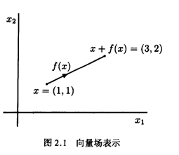
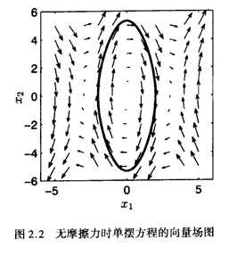

# 第一章 绪论

## 核心内容概述

1. **非线性系统模型与非线性现象**

   - 非线性系统用一阶微分方程组描述：

     $$
     \dot{x} = f(t, x, u), \quad y = h(t, x, u)
     $$

     其中，状态变量 $ x $，输入 $ u $，输出 $ y $ 构成非线性动态系统的核心元素。
   - 动力学系统分类为：

     - **强迫动态方程**：存在外部输入影响系统。
     - **自治系统(时不变系统)**：无外部输入，状态仅由初始值和动态关系决定。
2. **平衡点的分析**

   - 平衡点定义：使得 $\dot{x} = 0$ 的点。
   - 平衡点可能是孤立点，也可能存在一系列连续的平衡点（连续平衡点）。
3. **线性化近似**

   - 系统可通过线性化模型近似为线性动态方程：
     $$
     \dot{x} = A(t)x + B(t)u, \quad y = C(t)x + D(t)u
     $$
   - 通过分析线性系统的特性，可以近似判断原非线性系统的行为，但线性化方法有其局限性，尤其在系统远离平衡点时。一些非线性现象只在非线性条件发生。

## 非线性系统特性

1. **有限区域性**

   - 非线性系统的稳定性特性仅对当前区域有效，超出区域可能不适用。
2. **多平衡点**

   - 非线性系统可能存在多个平衡点，每个平衡点可能对应不同的初始状态吸引域。
3. **极限环**

   - 系统可能存在稳定的周期性振荡行为（极限环），特性由特征值虚部决定。
4. **混沌与复杂性**

   - 非线性系统可能展现复杂行为，包括周期倍增、混沌现象等。

## 笔记要点

- **非线性建模方法**：以状态方程为核心，灵活应用线性化方法分析局部稳定性。
- **平衡点与稳定性**：重点分析平衡点特性，判断其局部吸引域和动态行为。
- **线性化与局限性**：线性化是局部分析工具，但无法解决全局行为分析问题。
- **复杂行为研究方向**：
  - 极限环、分岔现象与混沌行为是非线性系统的重要研究领域。

#### 重点公式

1. 动态方程：
   $$
   \dot{x} = f(t, x, u), \quad y = h(t, x, u)
   $$
2. 线性化模型：
   $$
   \dot{x} = A(t)x + B(t)u, \quad y = C(t)x + D(t)u
   $$

### 第二章：二阶系统

#### 核心概念与定义

1. **二阶自治系统的定义**：
   - 由两个标量微分方程组成的系统：
     $$
     \dot{x}_1 = f_1(x_1, x_2),
     $$
     $$
     \dot{x}_2 = f_2(x_1, x_2).
     $$
   - 系统状态由两个变量 $x_1$ 和 $x_2$ 表示。

2. **轨线和相图**：
   - **轨线**：是状态变量 $x_1(t)$ 和 $x_2(t)$ 随时间的解组成的曲线，表示系统状态在状态空间中的变化路径。
   - **相图**：通过绘制向量场 $f(x)$（即 $(f_1, f_2)$）显示系统状态的演化趋势，图中的箭头表示状态的变化方向。
   - 如图 2.2，向量场展示了无摩擦单摆方程的运动行为，其轨线可能是闭合的（周期运动）。

3. **状态向量场 $f(x)$**：
   - $f(x) = (f_1(x_1, x_2), f_2(x_1, x_2))$，将系统的每一个状态 $x = (x_1, x_2)$ 映射为一个向量。
   - 向量的方向和大小反映了系统状态随时间的变化。

4. **二阶系统的特点**：
   - 状态变量 $x_1, x_2$ 在状态空间中的运动由向量场确定，轨线表示从初始点出发的演化路径。
   - 对于保守系统（如无阻尼单摆），轨线可能是闭合的（周期轨迹）。

#### 示例：无阻尼单摆方程
- 系统方程：
  $$
  \dot{x}_1 = x_2,
  $$
  $$
  \dot{x}_2 = -10\sin x_1.
  $$
- 向量场的长度取决于函数 $f(x)$ 的值，其方向表示状态变化的趋势。
- 初始点决定了系统在状态空间中的演化路径。

#### 相图特性
- **相图中的轨迹**：
  - 所有解的轨迹均满足二阶系统方程（2.1）和（2.2）。
  - 对于保守系统，轨迹可能是闭合的曲线，表示周期性行为。
  - 图 2.2 中的闭合轨迹对应无阻尼单摆的周期运动。

- **向量场特点**：
  - 向量场由系统方程决定，是系统状态空间的全局描述。
  - 通过向量场可以分析系统的稳定性、平衡点以及轨迹的周期性。

#### 笔记要点
1. **轨线与相图**：
   - 轨线是系统状态的时间演化路径，显示系统行为。
   - 相图通过向量场提供系统的全局动力学特性。

2. **保守系统的周期行为**：
   - 在没有摩擦或能量耗散时，系统的运动通常是周期性的，轨线闭合。

3. **状态向量场的意义**：
   - 向量场的方向表示状态变化趋势，大小表示变化速率。

4. **实际意义**：
   - 相图为分析系统稳定性和动力学行为提供了直观工具。
   - 在工程和物理中，广泛应用于如单摆、电路、振动系统等领域的研究。