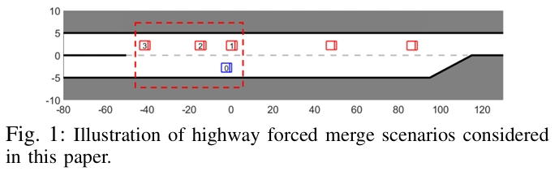
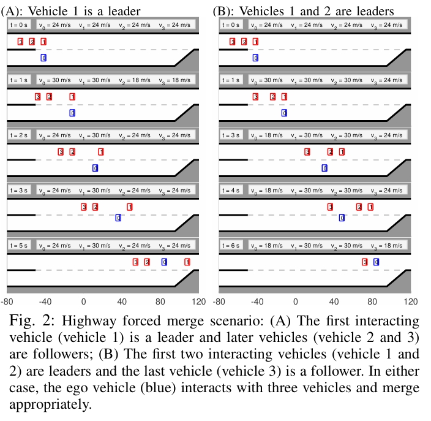
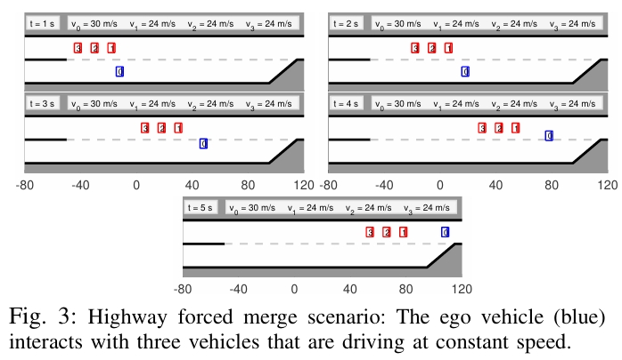
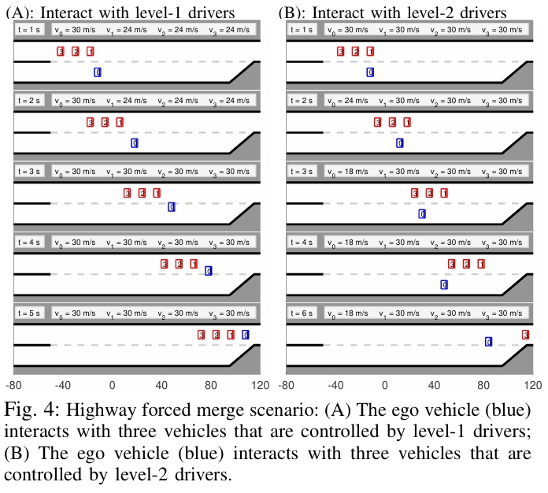

# Cooperation-Aware Decision Making for Autonomous Vehicles in Merge Scenarios

摘要

高速公路并线对于自动驾驶车辆来说是一个具有挑战性的任务，因为车辆必须与其他车辆互动，在当前车道结束前找到一个安全的并线空隙，同时确保安全（即避免碰撞）。本文针对强制并线场景中的自动驾驶车辆规划与控制问题，提出了一种基于部分可观测的领导者-跟随者博弈的新型决策算法，该算法模拟了并线车辆与高速行驶车辆之间的交互。在该算法中，自动驾驶车辆使用基于滚动优化的控制策略，适应在线估计的其他车辆驾驶意图，从而同时实现安全（避免碰撞）和活跃性（完成并线任务）。通过多种基于仿真的案例研究对该算法进行了验证。

引言

高速公路并线对于自动驾驶车辆来说是一项挑战性任务。在强制并线场景中，车辆需要在当前车道结束前，识别高速车流中的安全空隙并完成并线操作。在这一过程中，尤其是在交通密集的情况下，并线车辆与高速车道上其他车辆之间通常需要交互和协作。具体而言，目标车道上的车辆可能选择让并线车辆在其后方并入车流（称为“继续前进”），或者选择为并线车辆让路（即允许并线车辆在其前方并入）。是否选择继续前进或让路不仅取决于交通状况（如两车之间的相对位置和速度），还与驾驶员的性格类型有关。例如，在相似情况下，激进型驾驶员可能倾向于继续前进，而谨慎型驾驶员可能更愿意让路。

在这样的场景下，对于并线车辆而言，识别交互车辆的协作意图（即继续前进或让路）至关重要，这有助于评估空隙是否足够安全以进行并线，并决定如何并入该空隙。本文针对强制并线场景中的协作感知自动驾驶车辆规划与控制问题展开研究。

目前，有多项研究采用强化学习（RL）方法来解决自动驾驶车辆在高速公路上的规划与控制问题，包括并线场景。在这些研究中，为了应对其他车辆多样化的协作意图，[5]引入了“协作性”概念到智能驾驶员模型中；[6]则通过在RL训练过程中使用不同的奖励函数来表示不同类型的驾驶员。然而，典型的RL方法存在一个主要缺点，即缺乏可解释性，这也导致了安全性无法得到充分保障。

一种能够提供可解释的协作感知控制解决方案的策略，是在控制算法中明确纳入对车辆交互和/或协作行为的预测模型。例如，[7]通过一种名为“社会生成对抗网络”的深度神经网络预测其他车辆在响应主车动作时的未来轨迹，并将这些轨迹预测结果纳入模型预测控制算法中，以确定主车的最优动作。然而，[7]的方法未能考虑不同驾驶员类型导致的协作意图的差异性，因为它对所有驾驶员使用相同的神经网络来生成轨迹预测。

部分可观测马尔可夫决策过程（POMDP）框架是处理交互不确定性（例如，由于其他车辆的多样化协作意图引起的不确定性）的常见选择。在POMDP框架中，这些不确定性被建模为潜在变量，并基于观察到的轨迹在线估计。然而，大多数基于POMDP的方法通常通过在奖励/成本函数中加入惩罚项来促进自动驾驶车辆的安全性，但这通常无法提供明确的安全性保障（例如，以概率形式明确说明安全性）。

本文提出了一种针对强制并线场景的自动驾驶车辆规划与控制的新型决策算法。在该算法中，车辆之间的交互和/或协作关系通过一个包含多个并行领导者-跟随者对的显式博弈模型——领导者-跟随者博弈——来表示。为了应对交互不确定性，车辆之间的领导者-跟随者关系被建模为POMDP结构中的潜在变量，并基于观察到的轨迹在线估计。随后，自动驾驶主车利用基于滚动优化的策略，适应最新的潜在变量估计结果，优化决策以同时实现安全性（避免碰撞）和活跃性（完成并线任务）。

该决策算法相较于上述现有方法的优势如下：

1. 该算法通过博弈模型预测车辆交互和/或协作轨迹，提供可解释的控制解决方案。
2. 该算法通过在POMDP结构中将不确定性建模为潜在变量，并基于观测轨迹和贝叶斯推断在线估计这些变量，处理由其他车辆多样化协作意图引起的交互不确定性。
3. 该算法将车辆的安全性要求表述为约束条件，并在交互不确定性下提供明确的概率安全性保障（即用户指定的安全性概率下界）。

II. 问题陈述

本文的重点是为自动驾驶车辆提供高层次的决策支持，使其能够安全地并入高速公路。所提出的算法旨在生成自动驾驶车辆的行为决策或参考路径点，这些决策随后由车辆通过低层控制回路（如加速和转向控制）进行跟踪。

A. 研究场景

图1展示了本文研究的场景，其中蓝色的自动驾驶车辆（自车）位于加速车道，需要在加速车道结束前并入高速公路。此时，高速公路上有多辆其他车辆（红色）在行驶。在这种场景中，自动驾驶车辆需要与其他车辆进行互动与协作，以实现安全的并线。

B. 车辆运动学模型

我们采用以下离散时间运动方程来表示车辆在前进和变道过程中的运动学行为：

$$
x(t+1) = x(t) + v_x(t) \Delta t,
$$

$$
v_x(t+1) = v_x(t) + a(t) \Delta t,
$$

$$
y(t+1) = y(t) + v_y(t) \Delta t,
$$

其中，$x(t)$ 和 $y(t)$ 分别表示车辆在离散时间 $t$ 的纵向和横向位置；$v_x(t)$ 和 $v_y(t)$ 分别表示车辆在 $t$ 时刻的纵向和横向速度；$a(t)$ 表示车辆在 $t$ 时刻的纵向加速度；$\Delta t$ 为采样间隔。在该模型中，车辆状态表示为 $s = [x, v_x, y]^T$，车辆动作表示为 $u = [a, v_y]^T$。我们假设自动驾驶自车和其他交互车辆均遵循上述运动学模型，用 $s_0$ 表示自车状态，用 $s_k$ 表示每个交互车辆 $k$ 的状态，其中 $k \in \{1, 2, \dots \}$。类似地，用 $u_0 \in A_0$ 表示自车的动作，用 $u_k \in A_k$ 表示交互车辆 $k$ 的动作，其中 $A_0$ 和 $A_k$ 分别表示自车和交互车辆可采取的动作集合。

C. 动作空间

我们通过以下五种动作建模自车的驾驶行为：

1. **“保持”：** 保持当前横向位置和速度；
2. **“加速”：** 保持当前横向位置并以 $a$ [m/s²] 加速，但不超过速度上限 $v_{\text{max}}$ [m/s]；
3. **“减速”：** 保持当前横向位置并以 $-a$ [m/s²] 减速，但不低于速度下限 $v_{\text{min}}$ [m/s]；
4. **“向左转向”：** 以横向速度 $v_y = w_{\text{lane}}/3$ [m/s] 移向左侧车道，其中 $w_{\text{lane}}$ 为车道宽度；
5. **“向右转向”：** 以横向速度 $v_y = -w_{\text{lane}}/3$ [m/s] 移向右侧车道。

基于上述动作，完成一次并线至少需要3个时间步长，这考虑了车道间的动态转换，并允许车辆在不恰当的并线尝试时中止并暂时返回加速车道。与之前将变道建模为单步事件的模型相比，这种改进模型更为合理。

对于目标车道中的车辆，其驾驶行为建模为“保持”、“加速”和“减速”，因为这些车辆不会变道。

D. 奖励函数

奖励函数 $R(s, u_0, u_1)$ 是驾驶员目标的数学表示，其中 $s = [s_0, s_1]^T$ 表示交通状态。在与一个交互车辆的情况下，交通状态由这两辆车的状态组成，自车的奖励取决于两车的状态和动作。本文采用以下奖励函数：

$$
R(s, u_0, u_1) = w^T r,
$$

其中 $r = [r_1, r_2, r_3, r_4, r_5]^T$，$w \in \mathbb{R}^5_+$ 为权重向量，奖励项 $r_1, \dots, r_5$ 定义如下：

- $r_1$：车辆碰撞指示器。如果自车的边界框与其他车辆重叠，则 $r_1 = -1$；否则 $r_1 = 0$。为了优先考虑车辆安全，$r_1$ 的权重较大。
- $r_2$：驶出道路边界的指示器。如果自车进入黑色实线表示的道路边界之外，则 $r_2 = -1$；否则 $r_2 = 0$。
- $r_3$ 和 $r_4$：车辆活跃性指标。定义为

  $$
  r_3 = x_0, \quad r_4 = -|y_0 - y_r|,
  $$

  其中 $y_r$ 表示目标车道的中心。为了促进在适当情况下的并线，$r_4$ 的权重高于 $r_3$。
- $r_5$：对与其他车辆过于接近的惩罚。如果自车的扩展边界框（7 [m] × 3 [m]）与其他车辆重叠，则 $r_5 = -1$；否则 $r_5 = 0$。此项用于鼓励自车与其他车辆保持合理的安全距离，以提升安全性与舒适性。

E. 基于滚动优化的控制策略

我们为自动驾驶自车设计了基于滚动优化的控制策略。每个时间步长 $t$，自车求解以下优化问题，确定最优动作序列 $u^*_0(t) = \{u_0(t), u_0(t+1), \dots, u_0(t+N-1)\}$，以最大化其在规划范围 $N$ 内的累积奖励：

$$
u^*_0(t) = \underset{u_0(t+\tau) \in A_0}{\text{argmax}} \sum_{\tau=0}^{N-1} \lambda^\tau R(s(t+\tau), u_0(t+\tau), u_1(t+\tau)),
$$

其中 $\lambda \in (0, 1)$ 为折扣因子，$R$ 为奖励函数，$S_{\text{safe}}$ 为安全交通状态集合，用于表示硬性安全要求（如避免碰撞、道路边界约束等）。在获得最优动作序列 $u^*_0(t)$ 后，自车在当前时间步内应用第一个动作 $u_0(t)$，随后在下一个时间步重复该过程。

III. 用于车辆协作行为的领导者-跟随者博弈模型

在高速公路强制并线过程中，并线车辆（自车）需要与目标车道上的车辆交互。目标车道上的车辆可能会根据交通状况和各自的驾驶偏好选择继续前进或为并线车辆让路。本文提出了一种基于成对领导者-跟随者关系的博弈模型，即领导者-跟随者博弈，用以表示驾驶员的协作意图及其导致的车辆行为。在该模型中，决定在另一辆车之前通过的车辆（或驾驶员）是这对车辆中的“领导者”，而决定为另一辆车让路的车辆是“跟随者”。领导者和跟随者将遵循不同的决策策略。

这种领导者-跟随者博弈模型最初由文献[12]提出，并被证明可以有效建模交叉路口交通场景中的车辆交互和协作行为。本文对该博弈模型进行了简要回顾，并将其应用于本文所研究的高速公路强制并线场景。

令领导者和跟随者的动作序列分别为 $\gamma_l(t) = \{u_l(t + \tau)\}_{\tau=0}^{N-1} \in \Gamma_l = (A_l)^N$ 和 $\gamma_f(t) = \{u_f(t + \tau)\}_{\tau=0}^{N-1} \in \Gamma_f = (A_f)^N$，其中 $A_l$ 和 $A_f$ 分别为领导者和跟随者的动作空间。假设两方的决策目标是最大化各自的累积奖励，记为 $R̄_l(s(t), \gamma_l(t), \gamma_f(t))$ 和 $R̄_f(s(t), \gamma_l(t), \gamma_f(t))$，定义如下：

$$
R̄_\sigma(s(t), \gamma_l(t), \gamma_f(t)) = \sum_{\tau=0}^{N-1} \lambda^\tau R_\sigma(s(t+\tau), u_l(t+\tau), u_f(t+\tau)),
$$

其中 $\sigma \in \{\text{leader}, \text{follower}$，$R_\sigma$ 是领导者或跟随者的一步奖励函数（参考公式(2)）。

我们定义领导者和跟随者的决策过程如下：

$$
\gamma^*_l(t) = \argmax_{\gamma_l \in \Gamma_l} Q_l(s(t), \gamma_l),
$$

$$
\gamma^*_f(t) = \argmax_{\gamma_f \in \Gamma_f} Q_f(s(t), \gamma_f),
$$

其中 $\gamma^*_l(t)$ 和 $\gamma^*_f(t)$ 分别是领导者和跟随者在当前交通状态 $s(t)$ 下的最优动作序列，而 $Q_l$ 和 $Q_f$ 分别定义为：

$$
Q_l(s(t), \gamma_l) = \min_{\gamma_f \in \Gamma^*_f(s(t))} R̄_l(s(t), \gamma_l, \gamma_f),
$$

$$
Q_f(s(t), \gamma_f) = \min_{\gamma_l \in \Gamma_l} R̄_f(s(t), \gamma_l, \gamma_f),
$$

其中 $\Gamma^*_f(s(t))$ 表示跟随者在当前交通状态 $s(t)$ 下的最优动作序列集合。

上述决策模型的基本思想可以解释如下：

1. 跟随者是指决定为另一车辆让路的驾驶员。由于对其他车辆决策的不确定性，假设跟随者采用“最大-最小”策略（公式(7)和(9)），即在其他车辆决策不确定的最坏情况下最大化自己的奖励。这表示一种“谨慎”或“保守”的驾驶策略。
2. 领导者是指决定在另一车辆之前通过的驾驶员。假设领导者在跟随者会采取“最大-最小”策略的前提下最大化自己的奖励，这导致了公式(6)和(8)中的决策过程。这是一种“积极”的驾驶策略。

文献[12]表明，上述基于领导者-跟随者的决策模型能够有效地表示交叉路口场景中驾驶员的继续前进或让路意图及其车辆行为。

需要注意的是，上述领导者-跟随者博弈模型与斯塔克尔博格（Stackelberg）博弈模型有所不同。斯塔克尔博格模型假设跟随者必须能够在领导者决策后立即观察并响应，而这一假设在交通场景中可能不成立，因为车辆的动态行为会导致驾驶员决策逐步显现，同时还存在驾驶员的反应延迟。相比之下，模型(6)-(9)并不依赖此类假设。

该模型可用于在已知其他驾驶员的协作意图时预测其决策和未来轨迹。然而，在实际交通场景中，由于驾驶员的意图不仅取决于交通状况，还与其驾驶风格/类型有关，因此可能无法事先知道其他驾驶员的协作意图。为了应对这种不确定性，本文提出了一种将协作意图的不确定性建模为潜在变量的部分可观测决策方法。接下来将详细介绍。

IV. 在协作意图不确定性下的决策

本节首先描述了在与单一车辆交互的情况下，针对高速公路强制并线场景的协作意图不确定性决策算法。然后，将该算法扩展到多车辆交互场景，通过成对交互的方式处理复杂交通环境。

A. 在与单一交互车辆的高速公路强制并线中的决策

本文采用了文献[15]中提出的基于随机预测控制的机会约束部分可观测马尔可夫决策过程（POMDP）方法，以解决协作意图不确定性下的最优自动驾驶车辆动作问题。

首先，定义交通系统的扩展状态为 $s = [s_0, s_1, \sigma]^\top$，其中 $\sigma \in \{\text{leader}, \text{follower}\}$ 表示交互车辆的领导者/跟随者角色，该角色在先验上对自车是未知的。扩展系统的状态转移可描述为：

$$
s(t+1) = 
\begin{bmatrix}
s_0(t+1) \\
s_1(t+1) \\
\sigma
\end{bmatrix}
=
\begin{bmatrix}
f(s_0(t), u_0(t)) \\
f(s_1(t), u_1(t)) \\
\sigma
\end{bmatrix},
\quad
o(t) = g(s(t)) =
\begin{bmatrix}
s_0(t) \\
s_1(t)
\end{bmatrix},
$$

其中 $f$ 表示车辆的运动学模型（参见公式(1)），$u_0(t)$ 和 $u_1(t)$ 分别为自车和交互车辆的动作，$o(t)$ 为自车的观测值。根据领导者-跟随者决策模型（公式(6)-(9)），交互车辆的动作 $u_1(t)$ 可确定为：

$$
u_1(t) =
\begin{cases} 
u^*_l(t), & \text{若 } \sigma = \text{leader}, \\
u^*_f(t), & \text{若 } \sigma = \text{follower},
\end{cases}
$$

其中 $u^*_l(t)$ 和 $u^*_f(t)$ 分别是领导者和跟随者的最优动作序列中的第一个动作（参考公式(6)和(7)）。

为考虑交互车辆推理过程中的多样性和模型偏差，定义 $u \in A_1$ 的质量值为：

$$
Q_\sigma(s(t), u) = \sum_{\gamma \in \Gamma^\sigma_1(u)} Q_\sigma(s(t), \gamma),
$$

其中 $\Gamma^\sigma_1(u)$ 表示以动作 $u$ 开头的动作序列集合，采用“软最大化决策规则”[16]：

$$
P(u_1(t) = u \mid \sigma, s(t)) = \frac{\exp(Q_\sigma(s(t), u))}{\sum_{u' \in A_1} \exp(Q_\sigma(s(t), u'))},
$$

其中 $P(\cdot \mid \cdot, \cdot)$ 表示条件概率。

假设自车对交互车辆的角色 $\sigma$ 有一个先验信念 $P(\sigma = l)$，$l \in \{\text{leader}, \text{follower}\}$。基于自车的所有先前观测值和动作：

$$
\xi(t) = \{o(0), o(1), \dots, o(t), u_0(0), u_0(1), \dots, u_0(t-1)\},
$$

自车能够计算交互车辆作为领导者/跟随者的后验信念 $P(\sigma = l \mid \xi(t))$。

具体来说，交互车辆角色的识别可以通过以下结果实现：

**命题1：** 给定交互车辆的先验信念 $P(\sigma = l \mid \xi(t-1))$、自车的动作 $u_0(t-1)$ 和新的观测 $o(t)$，交互车辆的后验信念可通过以下公式计算：

$$
P(\sigma = l \mid \xi(t)) = 
\frac{P(s(t) = o(t) \mid u_0(t-1), \sigma = l, s(t-1)) P(\sigma = l \mid \xi(t-1))}
{\sum_{l' \in \{\text{leader}, \text{follower}\}} P(s(t) = o(t) \mid u_0(t-1), \sigma = l', s(t-1)) P(\sigma = l' \mid \xi(t-1))},
$$

其中 $s(t-1) = o(t-1)$。

通过此过程，自车能够在不确定的情况下识别交互车辆的协作意图，并进行优化决策。优化问题定义为：

$$
u^*_0(t) = \argmax_{u_0(t+\tau) \in A_0} 
\mathbb{E} \left[\sum_{\tau=0}^{N-1} \lambda^\tau R(s(t+\tau), u_0(t+\tau), u_1(t+\tau)) \mid \xi(t)\right],
$$

$$
\text{约束条件：} P(s(t+\tau) \in S_{\text{safe}}, \forall \tau = 1, \dots, N \mid \xi(t)) \geq 1 - \epsilon,
$$

其中 $\epsilon \in [0, 1]$ 表示用户指定的约束满意度所需的概率下限。

B. 基于随机化决策规则的求解方法

为了简化上述部分可观测问题的求解过程，本文参考文献[15]的方法，将优化问题转化为概率空间中的优化问题，通过标准的非线性规划求解。

C. 扩展到多车辆交互场景

在繁忙交通环境中，可能存在多个干扰车辆。本文提出了一种基于成对交互的计算方法，将多车辆交互划分为多个独立的自车-交互车辆对，从而在可计算性和准确性之间取得平衡。每对交互使用相同的转移核和观测核，并采用线性增长的计算复杂度解决此类问题。

V. 仿真结果

本节展示了仿真结果，以验证所提出的博弈论决策算法的有效性。所研究的交通场景如图1所示。博弈论决策算法假设交互车辆与自车进行领导者-跟随者博弈，并估计它们在博弈中的领导者/跟随者角色。我们首先测试算法在交互车辆由博弈中的领导者或跟随者控制时的性能，然后测试算法在面对其他类型驾驶员控制的交互车辆时的表现。

A. 交互车辆由领导者/跟随者控制

我们首先测试所提出的博弈论决策算法在交互车辆由领导者/跟随者角色控制的情况下的表现。规划视野设定为 $N=4$，机会约束参数设定为 $\epsilon = 0.01$。初始信念为对所有交互车辆 $k \in \{1, 2, 3\}$，均有 $P(\sigma_k = \text{leader}) = P(\sigma_k = \text{follower}) = 0.5$。

- **场景1：交互车辆包括1个领导者和2个跟随者**

  如图2(A)所示，自车与1辆领导者（车辆1）和2辆跟随者（车辆2和3）交互。自车识别交互车辆的意图后，在 $t = 1 \, \text{s}$ 后开始减速，并成功并入车辆1和车辆2之间的空隙。
- **场景2：交互车辆包括2个领导者和1个跟随者**

  如图2(B)所示，自车与2辆领导者（车辆1和2）和1辆跟随者（车辆3）交互。在这种情况下，自车观察到车辆1和2加速且不为其让路，因此决定减速并在车辆2和车辆3之间完成并线。

在上述两种情况下，自车的初始信念相同，即自车无法提前知道交互车辆是领导者还是跟随者。因此，自车依靠观测来估计交互车辆的领导者/跟随者角色。当所有交互车辆由博弈中的领导者或跟随者控制时，所提出的博弈论决策算法能够准确捕捉交互车辆的意图，并据此进行决策。

B. 交互车辆由其他类型驾驶员控制

为了进一步验证所提出算法的适应性，我们测试其在交互车辆由其他类型驾驶员控制时的表现。

- **测试1：交互车辆保持恒定速度**

  如图3所示，交互车辆以恒定速度行驶。自车使用所提出的博弈论决策算法来估计交互车辆的领导者/跟随者角色，并在所有交互车辆之前完成并线。

- **测试2：交互车辆为基于层级博弈的驾驶员**

  在文献[19]中，层级博弈理论被用于模拟无信号交叉路口的驾驶员交互行为。本文假设：

  - **Level-0驾驶员**：将所有其他车辆视为静止障碍物，即假设其他车辆总是为其让路（对应激进型驾驶员）。
  - **Level-1驾驶员**：假设其他车辆为Level-0驾驶员（对应谨慎型驾驶员）。
  - **Level-2驾驶员**：假设其他车辆为Level-1驾驶员（对应更激进型驾驶员）。
  - **场景1：与Level-1驾驶员交互**

    如图4(A)所示，交互车辆为Level-1驾驶员。自车发现其行为与领导者-跟随者博弈中的跟随者类似，因此选择在所有交互车辆之前完成并线。
  - **场景2：与Level-2驾驶员交互**

    如图4(B)所示，交互车辆为Level-2驾驶员。根据更新的信念，自车认为这些车辆的行为类似于博弈中的领导者。因此，自车减速并在所有交互车辆之后完成并线。

总结

仿真结果表明，所提出的博弈论决策算法能够在各种交互情境下有效运行，包括交互车辆由博弈模型的领导者/跟随者控制或由其他类型驾驶员控制的情况。此外，算法能够根据交通环境动态调整决策，确保安全性和任务完成度。
