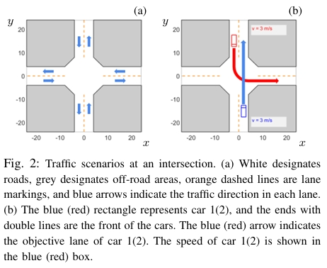
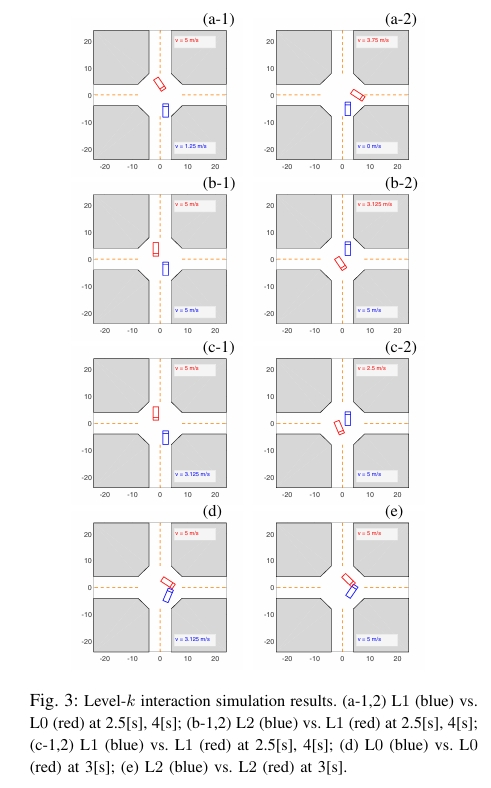
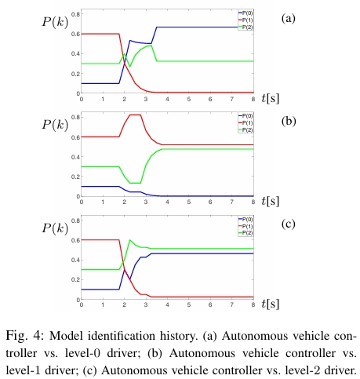
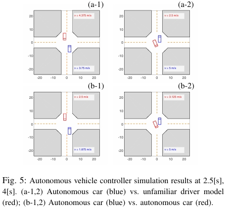

# 【机翻】Game Theoretic Modeling of Vehicle Interactions at Unsignalized Intersections and Application to Autonomous Vehicle Control

### 摘要

本文讨论了一种博弈论方法，用于建模在无信号控制的交叉口中车辆的延时、多步骤、交互决策过程。该车辆交互模型随后被用于定义自动驾驶车辆控制器。我们在一个常见的交叉口场景中进行了模拟，并展示了相关结果。

### I. 引言

在城市交通中，交叉口往往是驾驶员或自动驾驶车辆面临的最复杂场景之一。在交叉口处，车辆不仅要与其他车辆互动，还需与其他交通参与者（如行人）互动。每辆车需要连续进行不同的操作，以实现自身目标，例如通过交叉口或转弯以进入所需的车道，同时避免事故发生。在决策过程中，每辆车都应考虑与其他车辆的互动。

在无信号控制的交叉口中，考虑这些互动尤为重要。由于缺乏交通信号灯的指导（可视为集中控制的交通管理），驾驶员或车辆需要自行判断是否、何时以及如何进入并通过交叉口。如果无法正确理解这些互动关系，可能会导致僵局——即没有车辆决定进入交叉口，或所有车辆都卡在交叉口中间。在更极端的情况下，还可能发生碰撞。

车辆与车辆或车辆与行人的互动可通过可达性方法进行分析和处理，例如参考文献[1]和[2]中的方法。然而，这些方法通常关注最坏情况，可能导致过于保守的结果。为了减少保守性，参考文献[2]假设每个交通参与者的预期路径已知，并通过概率性偏离预期路径来描述不确定的互动。然而，这些方法未能解决高层次的决策问题，即如何生成预期路径。此外，假设准确地了解其他交通参与者的预期路径可能不现实——人们只能通过自身推理预测他人的预期路径，而这种推理和预测往往并不完美。

另一种方法是利用博弈论来研究多主体系统中的策略推理，例如交通场景中多方参与者的互动决策。博弈论方法考虑到智能主体的理性，从而在建模互动时比基于可达性分析的最坏情况假设产生的结果更具参考价值。在文献[4]中，交叉口的车辆互动被建模为一次性博弈——每辆车根据收益矩阵选择“停车”或“前进”操作，而不考虑车辆动力学。博弈论在高速公路驾驶场景下的车辆互动建模已被文献[5]、[6]和[7]研究。在文献[7]中，考虑了一个简单的交叉口场景，即两条单车道道路和两辆欲通过直行穿越交叉口的车辆，这与本文所讨论的无信号控制多车道交叉口情况有所不同，本文中的车辆还可以进行转弯操作。

通过无信号控制交叉口的驾驶过程相当复杂——驾驶员需要根据当前遇到的最新情况迅速调整决策。因此，穿越交叉口可以被视为一个时间延展的、多步骤的决策过程，其中驾驶员之间或车辆之间的互动贯穿整个过程。

本文的主要贡献包括：1）提出了一种博弈论方法来建模在无信号交叉口的人类驾驶车辆的时间延展、多步骤和互动决策过程；2）基于车辆交互模型和多模型策略，定义了一个自动驾驶车辆控制器；3）在多种模拟交通场景中测试了算法性能，并展示了其良好的冲突解决能力。

需要注意的是，本文并未涉及集中控制的自动化交叉口管理方法（如参考文献[8]、[9]），即通过一个集中控制器对所有车辆的运动进行调度和管理。本文的重点是开发一个能够应对现有无人管理交叉口的自动驾驶车辆控制器，未来工作将考虑如何将本文的研究成果应用于实现自动化交叉口管理。

### II. 车辆模型

#### A. 动力学模型

我们使用以下离散时间模型来表示交叉口中车辆的动力学：

$$
x(t+ 1) = x(t) + v(t) \cos(\theta(t)) \Delta t,
$$

$$
y(t+ 1) = y(t) + v(t) \sin(\theta(t)) \Delta t,
$$

$$
v(t+ 1) = v(t) + a(t) \Delta t,
$$

$$
\theta(t+ 1) = \theta(t) + \omega(t) \Delta t,
$$

其中 $t$ 表示离散时间点，$(x, y) [m]$ 表示车辆的全局位置，$v [m/s]$ 表示车辆的速度，$\theta [rad]$ 表示车辆的偏航角（即车辆行驶方向与全局 x 轴的夹角），$a [m/s^2]$ 表示车辆的加速度，$\omega [rad/s]$ 表示车辆的偏航角速度，$\Delta t [s]$ 表示时间步长。车辆的加速度 $a(t)$ 和偏航角速度 $\omega(t)$ 是由车辆所选择的动作决定的，如下一小节所述。

由于本文主要关注高层次的决策过程，模型（1）已足够使用——更详细的车辆动力学与控制可在更低层次进行工程化处理，正如文献[10]中所述。

#### B. 动作集

我们用 $\Gamma$ 表示车辆在交叉口可能采取的动作集合，基于“动作点”人类驾驶模型[11], [12]。每个动作 $\gamma \in \Gamma$ 是一个 $(a, \omega)$ 对，决定了模型（1）的输入。在本文中，我们考虑以下动作集 $\Gamma$：

1. “保持”：$(a, \omega) = (0, 0)$;
2. “左转”：$(a, \omega) = (0, \pi/4)$;
3. “右转”：$(a, \omega) = (0, -\pi/4)$;
4. “加速”：$(a, \omega) = (2.5, 0)$;
5. “减速”：$(a, \omega) = (-2.5, 0)$;
6. “刹车”：$(a, \omega) = (-5, 0)$。

#### C. 动作选择

动作选择方法基于滚动视界优化。在每个时间步 $t$，车辆选择一系列动作 $\gamma := \{\gamma_0, \gamma_1, \cdots, \gamma_{n-1}\}, \gamma_i \in \Gamma, i = 0, \cdots, n-1$，以在视界长度为 $n$ 的范围内最大化累计奖励 $R$，假设这些动作在视界范围内逐步应用。找到实现最高累计奖励的动作序列 $\hat{\gamma}$ 后，车辆在当前步骤应用该序列的第一个动作 $\hat{\gamma}_0$。在 $\hat{\gamma}_0$重复。累计奖励的计算公式为：

$$
R(\gamma) = \sum_{i=0}^{n-1} \lambda^i R_i(\gamma),
$$

其中阶段奖励 $R_i(\gamma) = R(\gamma_i | s_i)$ 是给定当前预测交通状态 $s_i$ 的动作 $\gamma_i$ 的奖励函数，$\lambda \in [0, 1]$ 是折扣因子。预测交通状态 $s_i$ 的方法将在第三节中描述。注意，$s_i$ 包括了交叉口中所有车辆的状态。累计奖励 $R$ 的计算方法将在下一小节中给出。

#### D. 奖励函数

阶段奖励函数定义如下：

$$
R = w_1 ĉ + w_2 ŝ + w_3 ô + w_4 l̂ + w_5 d̂,
$$

其中 $w_i > 0, i = 1, \cdots, 5$ 为权重系数，指标 $ĉ$, $ŝ$, $ô$, $l̂$ 和 $d̂$ 的含义如下：

- $ĉ$（避免碰撞）：我们为每辆车定义一个碰撞避免区（c-zone），即车辆轮廓的矩形区域。如果自车的 c-zone 与任何其他车辆的 c-zone 有重叠，说明存在碰撞风险，此时 $ĉ$ 赋值为 -1，否则为 0。
- $ŝ$（安全距离）：我们为每辆车定义一个安全区（s-zone），即在 c-zone 基础上增加安全边距的矩形区域。如果自车的 s-zone 与其他车辆的 s-zone 有重叠，$ŝ$ 赋值为 -1，否则为 0。该项鼓励自车与其他车辆保持合理距离。
- $ô$（偏离道路）：自车应保持在道路上行驶。如果自车的 c-zone 超出道路边界（即与灰色阴影区重叠），则 $ô$ 赋值为 -1，否则为 0。
- $l̂$（逆向车道）：自车不应越过分隔逆向车流的车道标记（如美国的双黄线），或行驶在逆向车流车道中。如果出现任意一种情况，$l̂$ 赋值为 -1，否则为 0。
- $d̂$（到目标车道的距离）：自车有一个目标车道。此项奖励鼓励自车采取尽快接近/到达目标车道的行动。

$$
-\hat{d} = |x - x_r| + |y - y_r|
$$

### III. Level-k 博弈论决策

为了评估累计奖励（公式 (2)），需要在预测视界范围内预测交通状态 $s_i$, $i = 1, \cdots, n - 1$。我们使用博弈论模型来进行此预测。

大量心理学、认知科学和经济学的实验研究表明，在博弈中人类的推理具有层次结构（参见文献 [13]、[14]、[15]、[16]）。该推理层次结构的研究及其在博弈论中的应用被称为“Level-k 博弈论”。在文献 [5]、[6] 和 [17] 中，Level-k 博弈论被用于建模高速公路交通中的车辆交互。这种模型在文献 [6] 中与人类交通数据进行了对比。在本文中，我们同样利用 Level-k 博弈论来建模车辆在交叉口的交互行为。最近，人类代理的 Level-k 建模也被用于航空航天和能源领域的应用中[18]、[19]、[20]，其中人类与人类以及人类与自动化系统的互动起到了核心作用。

该模型基于这样一个理念：策略性代理（在本研究中为交叉口处的驾驶员/车辆）具有不同的推理层次。具体来说，Level-k 表示代理的推理深度。推理层次从 Level-0 开始。Level-0 代理为了追求其目标做出本能决策，不考虑自身与其他参与者之间的互动。而 Level-1 代理在决策过程中会考虑这些互动，特别是它假设所有其他代理都是 Level-0。具体而言，Level-1 代理假设所有其他代理都是 Level-0，因此这些代理只会做出本能的决策；Level-1 代理根据这一假设预测它们的行为以及由此产生的博弈演化；Level-1 代理随后在这样的演化中选择最佳响应来追求自己的目标。类似地，Level-k 代理假设所有其他代理都是 Level-(k-1)，并基于该假设进行预测并做出相应的响应。

在本文中，Level-0 驾驶员/车辆将交叉口中的其他车辆视为静止的障碍物，并据此选择其动作序列 $\hat{\gamma}_0$。在实际交通中，Level-0 驾驶员可能代表一种激进的驾驶风格，他们通常假设其他驾驶员会让路。

在定义了 Level-0 后，Level-k（$k \geq 1$）的动作选择程序在 2 个代理交互的情况下如下所示：

$$
R_k(\gamma) = R(\gamma|\hat{\gamma}^{other}_{k-1}) = \sum_{i=0}^{n-1} \lambda^i R_i(\gamma|\hat{\gamma}^{other}_{k-1})
$$

$$
\hat{\gamma}^{ego}_{k} \in \arg \max_{\gamma_i \in \Gamma} R_k(\gamma),
$$

其中 $\hat{\gamma}^{other}_{k-1} = \{\hat{\gamma}^{other}_{(k-1,0)}, \cdots, \hat{\gamma}^{other}_{(k-1,n-1)}\}$ 表示假设为 Level-(k-1) 的其他代理选择的动作序列，且

$$
R_i(\gamma|\hat{\gamma}^{other}_{k-1}) = R(\gamma_i|s_0, \gamma_0, \cdots, \gamma_{i-1}, \hat{\gamma}^{other}_{(k-1,0)}, \cdots, \hat{\gamma}^{other}_{(k-1,i)}),
$$

即每一步的奖励值 $R_i(\gamma)$ 取决于当前的交通状态 $s_0$、自车的动作序列 $\{\gamma_0, \cdots, \gamma_{i-1}\}$，以及其他代理的动作序列 $\{\hat{\gamma}^{other}_{(k-1,0)}, \cdots, \hat{\gamma}^{other}_{(k-1,i)}\}$。这种依赖关系反映了代理之间的互动。

为了更清晰地解释这种层次推理决策过程，以下举例说明：假设自车代理为 Level-2。首先，自车代理计算一个动作序列 $\hat{\gamma}^{ego}_{0}$，这是在假设其他代理为静止障碍物时的最优动作序列。接下来，自车代理计算其他代理的动作序列 $\hat{\gamma}^{other}_{1}$，即在假设自车代理在视界内应用 $\hat{\gamma}^{ego}_{0}$ 时其他代理的最优动作序列。最后，自车代理计算自身的动作序列 $\hat{\gamma}^{ego}_{2}$，这是在假设其他代理应用 $\hat{\gamma}^{other}_{1}$ 时的最优动作序列。

我们在此简化了计算过程：当 Level-k 的自车代理计算 $\hat{\gamma}^{ego}_{k}$ 时，假设其他代理应用 $\hat{\gamma}^{other}_{k-1}$，而该序列是基于假设自车代理为 Level-(k-2) 计算的。因此，$\hat{\gamma}^{other}_{k-1}$ 不依赖于 $\hat{\gamma}^{ego}_{k}$，可以先行确定。通过这种简化，我们避免了嵌套的反复推理，使计算可行。

虽然上述公式仅适用于两个代理的情况，但可以直接推广到多代理情况，并且在计算上具有良好的可扩展性。

### IV. 博弈论自动驾驶车辆控制器

基于已开发的 Level-k 博弈论驾驶员模型，我们可以为无信号控制的交叉口定义一个自动驾驶车辆控制器。该控制器基于多模型策略，并根据与之交互的每位驾驶员的模型选择最优动作。具体而言，自车（即使用此控制器的自动驾驶车辆）对每位其他代理（即其他驾驶员）模型的假设通过概率分布来表示。它在每次更新时，通过分析每个其他代理的实际动作，动态调整这种假设。

该控制器的原理基于这样一个观察：尽管人类在最初并不完全了解彼此的特征，但他们通过互动可以迅速加深对彼此的理解，从而有能力解决冲突。

在本文中，我们将处理限制在两代理交互的情况。自车的假设分布用 $P(k)$ 表示，它是其他代理被建模为 Level-k 的概率。文献[16]显示，人类在交互中通常是 Level-0、1 或 2 的推理者，Level-3 的推理者很少见。因此，本文仅考虑 $k \leq 2$，并设 $P(0) + P(1) + P(2) = 1$。

动作序列的期望累计奖励为：

$$
R_P(\gamma) = \sum_{k=0}^{2} P(k) R(\gamma|\hat{\gamma}^{other}_{k}),
$$

其中 $R(\hat{\gamma}^{other}_{k}) $ 由公式 (5) 定义。

自车选择达到最高累计奖励期望的动作序列：

$$
\hat{\gamma}^{ego}_{P} \in \arg \max_{\gamma_i \in \Gamma} R_P(\gamma)。
$$

在找到动作序列 $\hat{\gamma}^{ego}_{P}$ 后，自车在一个时间步内应用该序列的第一个动作。

此外，在其他代理选择动作 $\gamma^{other}$ 后，自动驾驶车辆控制器会将 $\gamma^{other}$ 与每个 Level-k 模型的预测动作序列 $\hat{\gamma}^{other}_{(k,0)}$ 的第一个动作进行比较，并通过以下公式增强对最匹配的模型 $k$ 的信任：

$$
k^* \in \arg \min_{k=0,1,2} \|\gamma_{other} - \hat{\gamma}_{other}^{(k,0)}\|,
$$

$$
P(k^*) \leftarrow P(k^*) + \Delta P,
$$

$$
P(k) \leftarrow P(k) / \left( \sum_{k=0}^{2} P(k) \right)，
$$

其中 $\|\cdot\|$ 表示动作 $\gamma^{other}$ 与 $\hat{\gamma}^{other}_{(k,0)}$ 之间差异的度量，在本文模拟中定义为 $\|\gamma_1 - \gamma_2\| = |a_1 - a_2| + |\omega_1 - \omega_2|$。由于我们将每辆车的动作选择限制在第二节定义的有限动作集 $\Gamma$ 中，当 $\gamma^{other} = \hat{\gamma}^{other}_{(k^*,0)}$ 时，$P(k^*)$ 值会增加。

需要注意的是，公式 (9) 仅在至少存在一个 $\hat{\gamma}^{other}_{(k,0)}$ 与其他值不同时才触发。否则，控制器没有信息来增强其假设，因为所有模型的动作选择是相同的。

值得注意的是，文献 [21] 中提出了一种自动驾驶的多策略方法，其中从有限策略集中选择策略供自车使用；而在我们的多模型方法中，自车使用多个模型来预测其他车辆的决策，然后根据每个模型相关的预测和其对每个模型的信任来确定自己的决策，每个模型基于博弈论方案创建。

### V. 结果

#### A. Level-k 交互的模拟结果

在本小节中，我们展示 Level-k 驾驶员之间的交互模拟结果。我们选择的交通场景如图 2(b) 所示。我们之所以选择该场景，是因为它在城市交通中经常出现，对于自动驾驶车辆而言也可能特别具有挑战性。

模拟的配置如下：每辆车的碰撞区（c-zone）和安全区（s-zone）分别为 5 米 × 2 米和 8 米 × 2.4 米的矩形区域，以车辆的几何中心为中心。车道宽度为 4 米。交叉口的中心区域是一个规则的八边形，如图 2(b) 所示。

我们使用 $\Delta t = 0.25$ 秒，视界长度 $n = 8$，折扣因子 $\lambda = 0.9$，并选择权重 $w_i$（i = 1, · · ·, 5）为：

$$
w_1 = 200, w_2 = 20, w_3 = 100, w_4 = 10, w_5 = 1。
$$

不同的权重选择可能反映不同的驾驶风格。使用上述权重时，模拟中表现出合理的驾驶行为。

特别地，我们将场景初始化为：两辆车，车 1（蓝色）和车 2（红色），分别向上和向下直行，距离交叉口入口相等（$|y_1(0)| = |y_2(0)| = 16$ 米），速度相同（4 米/秒）。该场景具有挑战性，因为它可能导致僵局。下文中我们将此初始化称为“场景 1”。我们测试了两辆车在不同推理层次组合下的交互行为。部分模拟结果如图 3 所示。

从模拟结果中可以观察到，对于 Level-k 与 Level-(k-1) 的情况，即当一辆车被建模为 Level-k，另一辆车被建模为 Level-(k-1) 时，两辆车能够解决冲突并成功到达各自的目标车道。这是合理的，因为当至少有一方正确假设并预测对方的动作时，它可以通过正确响应交通状态的演变来解决冲突。当两辆车都错误地假设对方的层次时，例如 Level-k 与 Level-k 的组合，车辆可能无法解决冲突。具体来说，在 Level-1 与 Level-1 的组合中，尽管蓝车一开始作出不必要的减速（为红车让路），两辆车最终还是到达了目标车道。然而，对于 Level-0 与 Level-0 和 Level-2 与 Level-2 的组合，车辆最终发生碰撞。

接下来，我们考虑另一种场景，在该场景中，车 1（蓝色）和车 2（红色）分别向上和向下直行，它们的 y 位置在 [12, 20] 米之间均匀随机选择，速度在 [3, 5] 米/秒之间均匀随机选择。我们将该初始化称为“场景 2”。对于每种层次组合，我们多次运行模拟。两辆车在 10 秒内成功解决冲突、到达目标车道、未发生碰撞且未偏离道路或进入逆向车道的模拟次数百分比如表 I 所示。

| 交互类型  | 冲突解决百分比 |
| --------- | -------------- |
| L1 vs. L0 | 99%            |
| L2 vs. L1 | 95%            |
| L0 vs. L0 | 41%            |
| L1 vs. L1 | 84%            |
| L2 vs. L2 | 57%            |
| L2 vs. L0 | 41%            |

从这些结果可以观察到，对于 Level-k 与 Level-(k-1) 的情况，冲突很可能被解决；而对于 Level-k 与 Level-k 的情况，车辆可能未能解决冲突。此外，我们观察到故障率高于日常交通中的观测情况。原因包括：1）在模拟中，层次在整个过程中是固定的，而人类驾驶员可能会根据与其他驾驶员的互动调整其层次。我们已经利用这一点来开发自动驾驶车辆控制器，其性能将在下一小节中展示。2）人类驾驶员可以通过其他方式进行沟通（例如眼神交流或手势），以帮助解决冲突；这些沟通方式在我们的模拟中未考虑。

#### B. 自动驾驶车辆控制器的模拟结果

在本小节中，我们展示所提出的基于多模型的自动驾驶车辆控制器的模拟结果。基于文献[16]中对人类行为的实验研究，我们初始化自动驾驶车辆对其他车辆模型的假设分布为 $P(0) = 0.1$、$P(1) = 0.6$、$P(2) = 0.3$。在每次更新步骤中，最优模型的概率增加 $\Delta P = 0.5$，然后重新归一化分布（参见公式 (9)）。

需要注意的是，如果控制器能够高效准确地识别驾驶员模型，其设计可使其做出正确响应。因此，我们选择展示控制器在与不同驾驶员类型互动时 $P(k)$ 的时间变化，以展示其性能。我们首先将模拟初始化为场景 1，让车 1（蓝色）由自动驾驶车辆控制器控制，车 2（红色）为不同的 Level-k 模型。结果如图 4 所示。

从这些结果可以看出，控制器能够高效地识别其互动的驾驶员的真实模型 $k^*$（通过增加 $P(k^*)$），从而在累计奖励中给予与 Level-$k^*$ 模型相关的更高权重，激励控制器偏向于对应于模型 $k^*$ 的最优动作。在该实验中，自动驾驶车辆和人类驾驶车辆都安全且及时地到达各自的目标车道，因此省略了模拟快照。

在上述实验中，控制器表现良好，因为其设计基于 Level-k 模型。为展示控制器的鲁棒性，我们进行了两个额外的实验，分别评估：1）控制器在面对一种它不熟悉的驾驶员模型时的性能；2）控制器在面对另一个同样由该控制器控制的车辆时的性能。

对于第一种情况，我们定义一种驾驶员模型（D）为：

$$
R_D(\gamma) = \frac{1}{2} R(\gamma|\hat{\gamma}_{0}^{other}) + \frac{1}{2} R(\gamma|\hat{\gamma}_{1}^{other}),
$$

$$
\hat{\gamma}^{ego}_{D} \in \arg \max_{\gamma_i \in \Gamma} R_D(\gamma),
$$

即该驾驶员假设一半其他驾驶员为 Level-0，另一半为 Level-1，并据此做出响应。此驾驶员模型与任一 Level-k 模型（$k = 0, 1, 2$）不同，因此不在多模型自动驾驶车辆控制器的模型集中。

对于第二种情况，我们运行模拟，让两辆车均由所开发的多模型控制器控制。

首先，我们在场景 1 中测试这两种情况，车 1（蓝色）由自动驾驶车辆控制器控制，车 2（红色）分别由新模型 (11) 和自动驾驶车辆控制器控制。模拟快照如图 5 所示。

然后，我们在场景 2 中测试控制器分别与 Level-k 模型（$k = 0, 1, 2$）、驾驶员模型 (11) 以及同样的控制器的交互，进行多次模拟。车 1 和车 2 在 10 秒内成功到达目标车道、未发生碰撞且未偏离道路或进入逆向车道的模拟次数百分比如表 II 所示。

| 交互类型      | 冲突解决百分比 |
| ------------- | -------------- |
| Auto vs. L0   | 94%            |
| Auto vs. L1   | 95%            |
| Auto vs. L2   | 94%            |
| Auto vs. D    | 90%            |
| Auto vs. Auto | 93%            |
