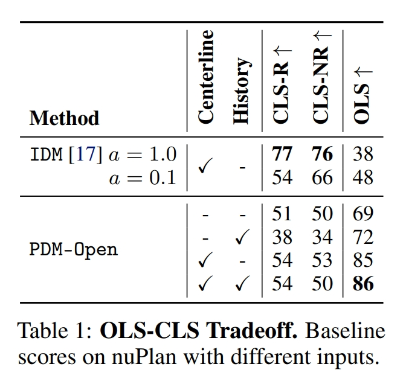
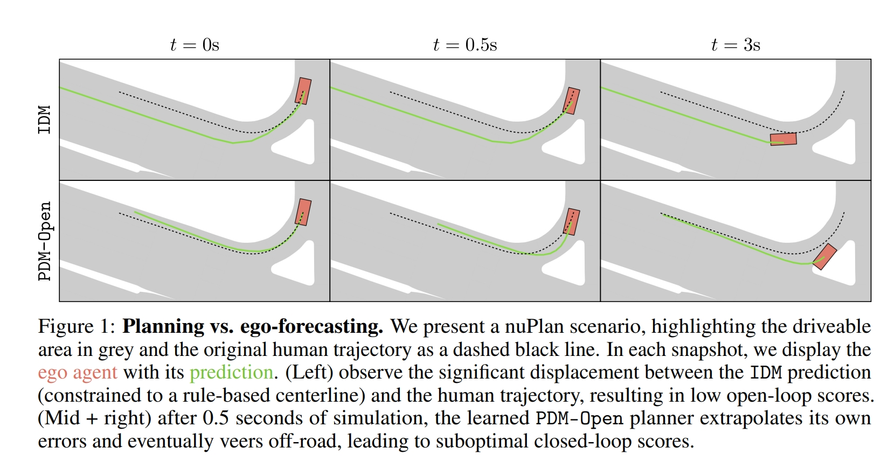
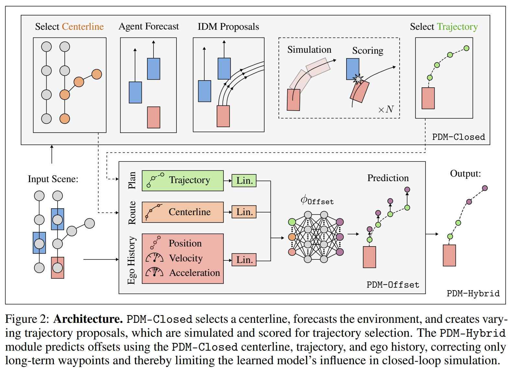
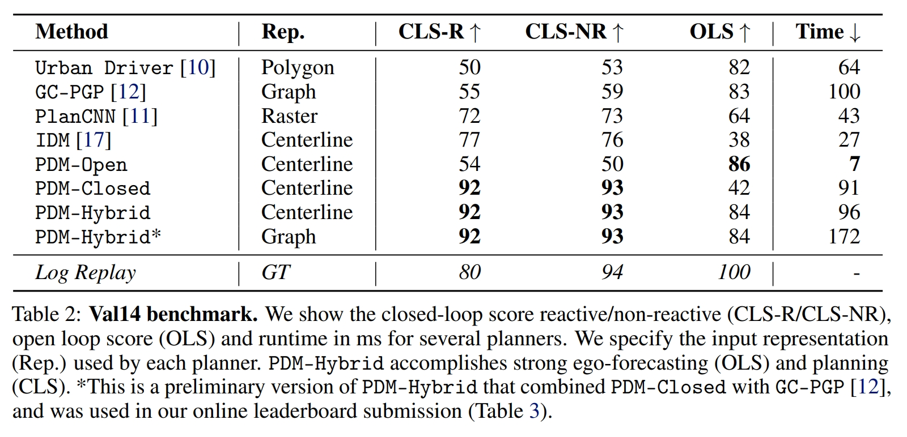
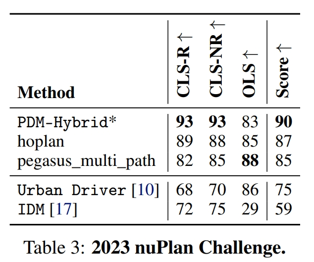
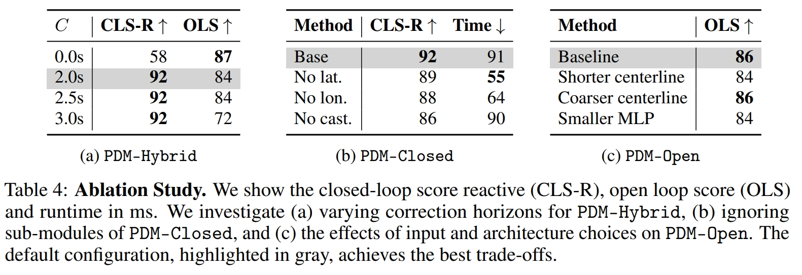

# Parting with Misconceptions about Learning-based Vehicle Motion Planning

- Daniel Dauner1,2 Marcel Hallgarten1,3 Andreas Geiger1,2 Kashyap Chitta1,2
- 1University of Tübingen 2Tübingen AI Center 3Robert Bosch GmbH
- https://github.com/autonomousvision/nuplan_garage

### 摘要

本文题为《重新审视学习驱动的车辆运动规划中的误解》，主要探讨了 nuPlan 数据集的发布对车辆运动规划研究的推动作用。nuPlan 是首个大型真实世界数据集，能够支持短期规划和长时预期预测。然而，当前系统难以同时满足这两个要求。本文发现短期和长时预测任务在本质上不匹配，应分别处理。此外，作者还对闭环规划进行了分析，揭示了基于学习的方法在复杂场景中的局限性，并强调了简单的基于规则的算法（如通过车道图搜索选择中心线）的有效性。最终提出了一种简单且高效的规划器，成功赢得了 nuPlan 规划挑战赛 2023。

### 引言

尽管基于学习的系统在车辆运动规划研究中取得了成功，但由于缺乏标准化的大规模数据集用于基准测试，这些系统的研究成果难以应用于实际场景。nuPlan 数据集和模拟器的发布改变了这一现状。该数据集包含了 1300 小时的真实车辆运动数据，能够推动新一代学习驱动的运动规划器的发展，从而减少手动设计的工作量并提升可扩展性。

利用这个新的基准，本文首次在一个开源和数据驱动的模拟环境中，对大规模的车辆运动规划进行了严格的实证分析，涵盖了多种最先进的规划方法，并使用官方的评估指标进行测试。我们的分析揭示了一些意想不到的发现：

1. 开环评估和闭环评估结果不一致。大多数学习驱动的规划器通过监督学习的方式进行训练，主要任务是预测自车未来的运动轨迹以达到指定的目标位置。然而，在 nuPlan 数据集中，这些规划器可以通过两种方式进行评估：(1) 开环评估，用距离为基础的指标测量自车预测的准确性，或 (2) 闭环评估，通过仿真环境中的行驶表现（例如行驶进度和碰撞率）来评估。我们发现，开环评估和闭环驾驶表现之间存在负相关关系。学习驱动的规划器在自车轨迹预测方面表现出色，但在闭环规划时难以保证安全，而基于规则的规划器则相反。

2. 基于规则的规划具有很好的通用性。我们意外地发现，已有二十多年历史的一个基于规则的规划方法在闭环评估指标上超越了所有最先进的学习驱动方法。这与当前的主流观点相悖，普遍认为基于规则的规划在泛化方面存在困难。

3. 对于自车轨迹预测，只需要中心线即可。我们实现了一个简单的学习驱动规划基线，它不依赖场景中的其他智能体信息，仅基于所需路线的中心线来预测自车的未来状态。这个基线在开环评估中达到了最先进的水平，而不需要使用复杂的场景表示方法（例如车道图、矢量地图、栅格地图或物体标记），这些在以往的研究中曾被认为是核心要素。

---

### 相关工作

**基于规则的规划**：基于规则的规划器提供了一种结构化、可解释的决策框架，通过显式规则来确定自动驾驶车辆的行为（例如，遇到前方障碍物时减速）。一种经典的基于规则的规划方法是智能驾驶模型（IDM），该模型旨在跟随前方车辆并保持安全距离。IDM 的一些扩展可以实现高速公路上的变道功能。然而，我们的工作并未专注于此，而是扩展 IDM，使其能够在不同超参数条件下执行多种策略，并通过评分来选择最佳选项。

此前的一些研究尝试将基于规则的决策与学习驱动的组件相结合，例如结合了学习驱动的智能体预测、代价学习（cost-based imitation learning）或基于规则的安全筛选。这些混合规划器通常能够预测未来的环境状态，从而辅助做出更具预见性的驾驶决策。预测可以是基于智能体的，亦即为每个参与者计算出轨迹，也可以是基于环境的，关注占用区域或代价地图。我们使用了一种简单的智能体预测模块作为 nuPlan 框架的起点。

**自车轨迹预测**：自车轨迹预测方法基于观察数据直接确定未来的行驶轨迹，分为端到端方法和模块化方法。端到端方法使用 LiDAR 扫描数据、RGB 图像或两者的组合进行预测，而模块化方法则使用鸟瞰图网格或状态向量等较低维度的输入来预测轨迹。我们的方法与一项并行研究的发现相辅相成，但该研究关注的是较短的自车轨迹预测（例如 8 秒），并未考虑较长时段的预测。本文中展示了在较长时段（8 秒）内，完全去除场景信息会影响性能，而只使用简单的中心线表示就能在开环评估中表现出色。

---

### 自车轨迹预测与规划存在不一致性

本节将介绍 nuPlan 数据驱动模拟器的背景信息，并通过两个基线实验展示自车轨迹预测与规划虽然通常被认为是相关任务，但由于在 nuPlan 上的定义不同，二者的目标并不一致。对一个任务的改进往往会导致另一个任务的退化。

#### nuPlan背景

nuPlan 是首个公开的、基于真实世界的规划基准，能够加速运动规划器的原型开发和测试。nuPlan 构建了一个尽量贴近真实世界的驾驶环境，采用数据驱动的模拟方法，将预先录制的 1300 小时的真实驾驶数据用于初始化场景，并用于开放和闭环驾驶性能的评估。因此，在仿真环境中，我们的方法依赖高精地图和准确的感知数据，不考虑定位误差、地图不完善或检测错误。在开环模拟中，整个日志会被重放（包括自车和其他智能体）。而在闭环模拟中，自车的行为则完全由待测试的规划器控制。闭环模拟有两种版本：非响应式（其他车辆沿原轨迹重放）和响应式（其他车辆使用 IDM 规划器）。

#### 评估指标

nuPlan 提供了三个官方评估指标：开环评分（OLS）、闭环评分-非响应式（CLS-NR）和闭环评分-响应式（CLS-R）。虽然 CLS-NR 和 CLS-R 的计算方法相同，但它们在背景交通行为上有所不同。OLS 中，子评分考虑了在 8 秒内位置和角度的偏差（包括平均偏差和最终偏差）。如果预测偏差超过阈值，OLS 得分则直接记为零。在 CLS 评估中，子评分包括碰撞时间、沿专家路线的进度、速度限制的符合性和驾驶舒适度。CLS 的乘数惩罚项包括碰撞、驶入不可行驶区域或违反驾驶方向等，若发生碰撞，CLS 得分将降为零。这些分数（包括 OLS 和 CLS）均在 0 至 100 的范围内，得分越高表示性能越好。由于 nuPlan 的评分指标组成较为复杂，因此详细的评分描述在补充材料中提供。

#### 智能驾驶模型（IDM）

在 nuPlan 中，简单的 IDM 基线不仅用于模拟 CLS-R 评估中的非自车智能体，还可作为自车的规划基线。nuPlan 地图以图形形式提供，中心线段被视作节点。选择这些节点后，IDM 沿中心线推断纵向轨迹。根据当前的位置 \(x\)、速度 \(v\) 和前车距离 \(s\)，IDM 使用以下策略迭代计算纵向加速度：

\[
\frac{dv}{dt} = a \left(1 - \left(\frac{v}{v_0}\right)^{\delta} - \left(\frac{s^*}{s}\right)^2\right)
\]

加速度限制 \(a\)、目标速度 \(v_0\)、安全距离 \(s^*\) 和指数 \(\delta\) 是手动选择的参数。该策略在速度接近 \(v_0\) 或与前车的距离为 \(s^*\) 时自动调节加速度。具体的超参数选择在补充材料中提供。

#### 不一致性

**基于中心线的自车轨迹预测**：我们提出了一种简单的预测模型 PDM-Open，这是一种多层感知机（MLP）模型，用于预测未来的路径点。此 MLP 的输入为 IDM 提取的中心线（c）以及自车的历史轨迹（h）。为适应 nuPlan 中高达 15 m/s 的高速行驶以及最长达 8 秒的预测时间范围，中心线以每米 1 个采样点的分辨率进行采样

，最多延伸至 120 米长。同时，自车历史记录包含过去两秒内的位置、速度和加速度信息，采样频率为 5Hz。中心线和历史轨迹均被线性投影为大小为 512 的特征向量，然后将二者拼接输入到含有两个 512 维隐藏层的 MLP 中，MLP 的输出为 8 秒的预测路径点，每 0.5 秒输出一个点。该模型通过对 177,000 个样本的 L1 损失训练得到，其设计远比现有的学习驱动规划器要简单。

**开环和闭环评分的权衡**：在实验中，我们对 IDM 和 PDM-Open 基线模型进行 nuPlan 评估指标的基准测试。表格 1 显示 IDM 和 PDM-Open 的不同版本在使用不同输入时的 OLS 和 CLS 得分。实验发现，减少 IDM 的加速度上限可提高开环得分（OLS），但会降低闭环得分（CLS）。IDM 在闭环性能上表现良好，而 PDM-Open 即便仅使用当前自车状态，也能在开环评估中优于 IDM。加入中心线输入显著提高了自车轨迹预测性能（OLS），同时显示了 OLS 和 CLS 之间存在显著的目标不一致。nuPlan 上这种反向关联的现象并不符合预期，尽管当前许多规划研究都在逐步采用自车轨迹预测。实验表明，自车轨迹预测并非达成驾驶性能的必要条件，但 nuPlan 挑战要求同时实现高 OLS 和 CLS。

在图 1 中展示的示例场景中，基于规则的 IDM 选择了与人类驾驶员不同的车道，但在整个仿真过程中保持在道路上。这带来了较高的 CLS 分数，但 OLS 较低。相反，学习驱动的 PDM-Open 预测的轨迹沿人类驾驶员选择的车道行驶，因此获得了高 OLS。然而，由于短期预测误差累积，其轨迹逐渐偏离可驾驶区域，导致较差的 CLS 分数。

### 方法

我们对 IDM 模型进行了扩展，融入了模型预测控制的多个概念，包括预测、轨迹生成、仿真、评分和选择，如图 2（顶部）所示。该模型称为 PDM-Closed。首先，依然需要通过图搜索来找到沿路线的车道序列，并提取它们的中心线，就像 IDM 规划器一样。

**预测**：在 nuPlan 中，仿真器为每个动态智能体（如车辆或行人）提供方向矢量和速度。我们使用一种简单而有效的常速预测方法，在 10Hz 的频率上对未来 8 秒的轨迹进行预测。

**轨迹生成**：在 IDM 规划器的校准过程中，我们发现当目标速度参数（\(v_0\)）被设定为单一值时，会在驾驶行为的激进性和进展性之间出现权衡。因此，我们通过实现五个不同目标速度的 IDM 策略（即所设定速度上限的 20%、40%、60%、80% 和 100%），生成一组轨迹。此外，每个目标速度还包含三个横向偏移量（±1 米和 0 米），最终生成 15 个轨迹提案。为减小后续阶段的计算需求，这些轨迹的预测范围为 4 秒，对应 10Hz 的频率。

**仿真**：nuPlan 中的轨迹通过迭代控制器（LQR 控制器）进行仿真，并使用运动学双轮模型传播自车状态。我们使用相同参数，并加速实现了这个双阶段管道，用于对提案进行仿真和评估。

**评分**：每条仿真的轨迹提案会根据交通规则遵守程度、进展和舒适度来评分。通过考虑横向和纵向的多样性，规划器可以避免与智能体预测的碰撞，并修正轨迹偏差。此外，我们的评分函数与 nuPlan 评估指标相似。详细信息请参阅补充材料。

**轨迹选择**：最终，PDM-Closed 选择得分最高的轨迹提案，并延展至整个预测范围，使用相应的 IDM 策略。如果最佳轨迹预计在 2 秒内发生碰撞，输出则被覆盖为紧急制动操作。

**提升长时精度**：为结合 PDM-Open 的精确自车轨迹预测能力和 PDM-Closed 的短时精确操作，我们提出了混合模型 PDM-Hybrid。具体来说，PDM-Hybrid 使用一个学习模块 PDM-Offset 来预测 PDM-Closed 轨迹的偏移量，如图 2（底部）所示。PDM-Hybrid 保持了闭环规划性能，同时提高了长时预测的精度。该模块通过补充长期路径点的偏移来修正 PDM-Closed 的轨迹，使其仅在闭环仿真中影响较长时段的路径点。 

PDM-Hybrid 的设计高度模块化，允许根据不同需求更换单独的组件，以便应对多样化的应用需求。未来工作中，我们可以探索将可微分算法模块化并融入统一的多任务架构中。

---

### 实验

本节将介绍我们提出的基准测试，并展示我们方法的驾驶表现。

**Val14 基准测试**：我们提供了用于训练和评估的标准化数据划分。训练集中包含 nuPlan 的所有 70 种场景类型，每种场景最多 4000 个样本，总计约 177,000 个训练场景。评估集则包含 nuPlan 排行榜中的 14 种场景类型，每种类型 100 个场景，总计 1,118 个场景。尽管略有不平衡（并非所有 14 种类型都有 100 个可用场景），我们的验证集与在线排行榜评估一致（见表 2 和表 3），确认了 Val14 基准测试作为在线测试集的有效代理。

**基线模型**：我们在研究中加入了多种基于自车轨迹预测的先进方法。Urban Driver 使用 PointNet 层对多边形进行编码，并在多头注意力模块后通过线性层预测轨迹。GC-PGP 则通过路线限制的车道图遍历对轨迹提案进行聚类，返回最可能的聚类中心。PlanCNN 使用卷积神经网络从栅格化特征中预测路径点，无需输入自车状态。我们的 PDM-Hybrid 初步版本结合了 GC-PGP 用作自车轨迹预测模块，并在排行榜上排名第一。

**结果**：结果见表 2。PlanCNN 在学习驱动的规划器中取得了最高的 CLS 得分，可能是因为它去掉了自车状态的输入，以开环精度换取了更高的闭环精度。与当前研究偏好图结构和矢量场景表示的趋势相反，本研究结果表明，栅格表示在闭环任务中并无明显劣势。我们还发现 PDM-Closed 在 CLS 方面较 IDM 有显著提升：从 76-77 提高到 92-93，这得益于我们在 3.3 节中提出的方法改进。此外，PDM-Open 在 OLS 上达到了 86 的最高分，并且仅使用中心线和自车状态作为输入。PDM-Hybrid 成功将 PDM-Closed 与 PDM-Open 结合，达到了强劲的 OLS 和 CLS 表现。

**挑战**：在 2023 年的 nuPlan 挑战中，PDM-Hybrid 的初步版本（使用图结构）在 25 个参赛团队中排名第一。排行榜评估考虑 CLS-R、CLS-NR 和 OLS 的平均值。尽管开环表现略有不足，但其闭环表现优异，取得了整体最佳成绩。由于排行榜关闭，最终版本（使用中心线）的 PDM-Hybrid 尚未进行官方测试。挑战中的顶级选手均结合了学习驱动的自车轨迹预测与基于规则的后处理步骤，以增强 CLS 表现。

**消融实验**：我们通过消融实验深入研究了设计选择。在表 4 中，分别展示了 PDM-Hybrid 在不同修正时间范围（C）下的 CLS-R 和 OLS 得分；PDM-Closed 省略不同模块的 CLS-R 和运行时间；以及 PDM-Open 的输入和架构变化对 OLS 的影响。实验表明，PDM-Hybrid 默认配置在 CLS 和 OLS 之间取得了最佳权衡。

---

### 讨论

尽管基于规则的规划常被批评为泛化能力有限，但我们的结果显示，在闭环 nuPlan 任务中，这种方法表现优异，且与真实世界的评估最为相似。显著的是，开环中的成功表现往往要求闭环性能的妥协。因此，模仿训练的自车轨迹

预测方法在闭环中表现不佳。这表明，基于规则的规划器仍具有潜力，值得进一步探索。同时，鉴于模仿训练方法在 nuPlan 上的表现有限，未来工作中这些方法在开箱即用的情况下可能有进一步优化的空间。

通过结合闭环规划和开环自车轨迹预测的优点，我们提出了一个混合模型。然而，这并未改善闭环驾驶性能；相反，它提升了开环表现，同时执行相同的驾驶操作。我们认为，将精准的开环自车轨迹预测视作实现长期规划目标的必要条件是一种误解。

尽管自车轨迹预测在可解释性和模拟人类行为评估中可能具有重要作用，我们建议将该评价限定于短期（例如 2 秒），以与闭环驾驶相关。当前 nuPlan 的开环评分（OLS）定义要求单模态的 8 秒预测，这对如背景交通模拟或资源分配等特定应用可能有用，但并不应作为规划性能的主要评价指标。

**局限性**：虽然我们显著改进了 IDM 模型，但 PDM 仍无法执行变道操作。在车辆位于两条车道之间时，变道尝试通常导致碰撞，从而在 nuPlan 指标中得到高罚分。PDM 依赖高精地图和精确的离线感知，这在实际驾驶中可能无法获得。尽管一些学习驱动的方法已在真实世界中进行测试，但对于基于规则的方法来说，实际部署仍面临重大挑战。此外，除保留的测试集外，我们的实验尚未具体评估模型在遇到分布偏移（如未见过的城镇或新情境类型）时的泛化能力，且所有实验都在单一的 nuPlan 模拟器上进行。因此，有必要认识到 nuPlan 的数据驱动仿真方法的内在局限性。

**结论**：本文识别出当前学习驱动的车辆运动规划中的一些常见误解。基于这些发现，我们提出了 PDM-Hybrid，该模型结合了 IDM 和学习驱动的自车轨迹预测模块，最终在 2023 年 nuPlan 比赛中超越了多种竞争方法，取得了第一名的成绩。
