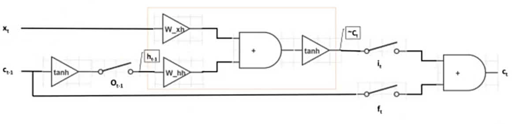
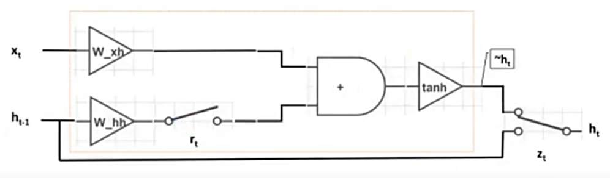

# LSTM和GRU的基本结构原理

## LSTM（长短期记忆网络）的基本结构原理

长短期记忆网络（Long Short-Term Memory, LSTM）是RNN的一种变体，专门用于解决标准RNN在处理长序列时的梯度消失和长时依赖问题。LSTM通过引入记忆单元和门控机制来控制信息的流动，从而更好地保持和利用长期依赖关系。

LSTM的核心组件包括：

1. **遗忘门（Forget Gate）**：
   - 作用：决定当前时间步是否保留上一时间步的记忆。
   - 公式：\( f_t = \sigma(W_f \cdot [h_{t-1}, x_t] + b_f) \)

2. **输入门（Input Gate）**：
   - 作用：决定当前时间步的输入信息有多少被保存到记忆单元。
   - 公式：
     \[
     i_t = \sigma(W_i \cdot [h_{t-1}, x_t] + b_i)
     \]
     \[
     \tilde{C}_t = \tanh(W_C \cdot [h_{t-1}, x_t] + b_C)
     \]

3. **记忆单元（Cell State）**：
   - 作用：在时间步之间传递信息，并进行更新。
   - 公式：
     \[
     C_t = f_t \ast C_{t-1} + i_t \ast \tilde{C}_t
     \]

4. **输出门（Output Gate）**：
   - 作用：决定隐藏状态的输出。
   - 公式：
     \[
     o_t = \sigma(W_o \cdot [h_{t-1}, x_t] + b_o)
     \]
     \[
     h_t = o_t \ast \tanh(C_t)
     \]

## GRU（门控循环单元）的基本结构原理

门控循环单元（Gated Recurrent Unit, GRU）是LSTM的简化版本，保留了门控机制，但结构更为紧凑，计算效率更高。

GRU的核心组件包括：

1. **更新门（Update Gate）**：
   - 作用：控制隐藏状态的更新程度，决定新信息和旧信息的混合比例。
   - 公式：\( z_t = \sigma(W_z \cdot [h_{t-1}, x_t] + b_z) \)

2. **重置门（Reset Gate）**：
   - 作用：决定前一隐藏状态对当前计算的影响。
   - 公式：\( r_t = \sigma(W_r \cdot [h_{t-1}, x_t] + b_r) \)

3. **新候选隐藏状态**：
   - 作用：通过结合重置门和当前输入生成新状态。
   - 公式：
     \[
     \tilde{h}_t = \tanh(W \cdot [r_t \ast h_{t-1}, x_t] + b)
     \]

4. **隐藏状态更新**：
   - 作用：更新当前隐藏状态。
   - 公式：
     \[
     h_t = (1 - z_t) \ast h_{t-1} + z_t \ast \tilde{h}_t
     \]

# LSTM的优势和劣势

## 优势

1. **长时依赖处理能力强**：LSTM的设计专门针对长时间依赖问题，能够在处理长序列时表现出色。
2. **防止梯度消失**：通过遗忘门和输入门，LSTM有效地控制梯度的传播，缓解了梯度消失的问题。

## 劣势

1. **计算复杂度高**：由于引入了多个门控机制，LSTM的计算量较大，训练速度较慢。
2. **参数量多**：LSTM需要学习的参数较多，增加了模型的复杂度和训练难度。

# GRU的优势和劣势

## 优势

1. **结构简单**：GRU去掉了LSTM中的输出门和独立的记忆单元，结构更为简单，计算效率更高。
2. **性能与LSTM相当**：在许多任务上，GRU的表现与LSTM相当，但参数更少、训练更快。

## 劣势

1. **长时依赖处理稍弱于LSTM**：尽管GRU能够处理长时间依赖，但由于其结构简化，相对于LSTM可能在处理极长依赖时表现略逊一筹。
2. **灵活性略低**：由于去除了部分门控机制，GRU在某些复杂任务上的表现可能不如LSTM灵活。

# 如何改进LSTM和GRU

1. **混合模型**：结合LSTM和GRU的优点，构建混合模型，利用两者的长处提升模型性能。
2. **引入注意力机制**：在LSTM或GRU的基础上添加注意力机制，使模型能够动态选择重要的信息，从而更好地处理长时依赖和复杂序列关系。
3. **优化门控机制**：通过实验调整或简化门控机制，使模型在保持性能的同时降低计算复杂度。
4. **采用更高效的架构**：例如Transformer模型，完全摒弃RNN结构，基于自注意力机制，可以提供更好的性能和并行计算能力。

# 面试题目和参考答案

## 1. 请解释LSTM的工作原理，并重点描述其三个门的作用。
**参考答案**：LSTM通过输入门、遗忘门和输出门控制信息的流动。输入门决定当前信息是否加入记忆，遗忘门决定之前的记忆是否被遗忘，输出门决定记忆单元的输出。LSTM的设计使其能够在较长的时间范围内捕捉依赖关系，从而解决梯度消失问题。

## 2. GRU与LSTM有何不同？它们的各自优缺点是什么？
**参考答案**：GRU是LSTM的简化版本，去掉了输出门和独立的记忆单元，结构更简单，计算效率更高，训练速度更快。尽管GRU的表现与LSTM相当，但在处理极长时间依赖时可能不如LSTM表现得稳定。GRU的灵活性略低于LSTM，但其结构的简化使其在计算效率上具有优势。

## 3. 如何在LSTM中加入注意力机制？为什么这么做？
**参考答案**：可以在LSTM的输出层添加注意力机制，通过计算输入序列中每个元素的重要性权重，动态选择和组合输入序列中的信息。这样做可以帮助LSTM更好地处理长时依赖关系，并在复杂任务（如机器翻译、文本摘要）中提供更好的性能。

## 4. 对比GRU和标准RNN，为什么GRU通常表现更好？
**参考答案**：GRU通过引入更新门和重置门解决了标准RNN中的梯度消失问题，使得网络在处理长序列时表现更好。此外，GRU的结构简化，相对于LSTM而言，既提升了计算效率又保留了较强的长时依赖处理能力。

## 5. 在实际应用中，如何选择使用LSTM或GRU？
**参考答案**：选择LSTM或GRU主要取决于任务的复杂度和计算资源。如果任务需要处理非常长的序列或复杂的依赖关系，且计算资源充足，可以选择LSTM。如果对计算效率要求较高，且处理的序列长度适中，GRU可能是更好的选择。可以通过实验比较两者在具体任务上的表现来最终决定。
