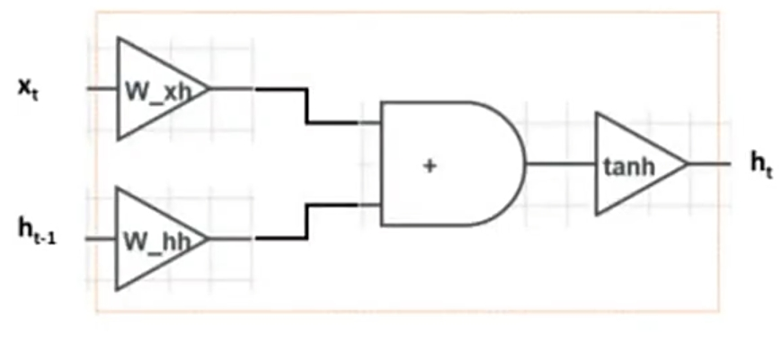

# RNN的基本结构原理

循环神经网络（Recurrent Neural Network, RNN）是一类用于处理序列数据的神经网络。与传统的前馈神经网络不同，RNN具有“记忆”功能，即可以保留和利用之前输入的信息，这使得RNN在处理序列数据（如时间序列、文本数据等）时非常有效。

RNN的基本结构可以描述如下：
1. **隐藏状态（Hidden State）**：RNN的核心是隐藏状态，它保存了网络当前时刻的信息，并在每一步更新。隐藏状态不仅依赖于当前输入，还依赖于前一时刻的隐藏状态，这使得RNN能够记住之前的输入。

2. **输入和输出**：在每个时间步（time step）t，RNN接收一个输入向量 \( x_t \)，结合前一时刻的隐藏状态 \( h_{t-1} \)，通过一个非线性函数（通常是tanh或ReLU），计算出当前的隐藏状态 \( h_t \)。然后，隐藏状态 \( h_t \) 再用于生成当前的输出 \( y_t \)。

3. **递归关系**：RNN的核心递归关系可以表示为：
   \[
   h_t = \phi(W_h x_t + U_h h_{t-1} + b_h)
   \]
   \[
   y_t = \sigma(W_y h_t + b_y)
   \]
   其中，\( \phi \) 和 \( \sigma \) 是非线性激活函数，\( W_h \)、\( U_h \) 和 \( W_y \) 是权重矩阵，\( b_h \) 和 \( b_y \) 是偏置向量。

# RNN的优势

1. **处理序列数据的能力**：RNN擅长处理序列数据，因为它能够记住之前的输入信息并利用这些信息进行预测。

2. **参数共享**：RNN在每个时间步使用相同的权重，这种参数共享的机制使得RNN可以处理不同长度的输入序列。

3. **时间顺序依赖**：RNN能够捕捉数据中的时间顺序依赖关系，这对语言建模、机器翻译等任务尤为重要。

# RNN的劣势

1. **梯度消失和梯度爆炸**：由于RNN的梯度需要在时间步上反向传播，当序列较长时，梯度可能会变得非常小（梯度消失）或非常大（梯度爆炸），导致训练困难。

2. **长时依赖问题**：RNN在处理长序列时，容易“遗忘”远距离的依赖关系，难以捕捉长时间依赖的信息。

3. **计算效率低**：RNN的序列计算方式是逐步进行的，难以并行化，因此训练时间较长。

# 如何改进RNN

为了克服RNN的上述问题，研究人员提出了多种改进方法：

1. **长短期记忆网络（LSTM）**：LSTM通过引入记忆单元和门控机制（输入门、遗忘门和输出门），有效解决了梯度消失和长时依赖问题。LSTM可以选择性地记住或忘记信息，从而更好地捕捉长时间的依赖关系。

2. **门控循环单元（GRU）**：GRU是LSTM的简化版本，使用了更少的参数，计算效率更高，同时在性能上与LSTM相当。GRU将遗忘门和输入门合并为一个更新门，并通过重置门来控制隐藏状态的更新。

3. **双向RNN（Bidirectional RNN）**：在标准RNN的基础上，双向RNN通过在两个方向上（从前到后和从后到前）处理序列数据，从而更好地捕捉全局信息。

4. **注意力机制（Attention Mechanism）**：注意力机制允许模型在处理当前时间步时，动态地选择和关注输入序列中的特定部分，从而更好地建模长时间依赖关系。注意力机制在机器翻译、文本摘要等任务中得到了广泛应用。

5. **Transformer模型**：Transformer是基于自注意力机制的模型，完全摒弃了RNN的递归结构，大大提高了并行计算能力，已经成为许多序列建模任务的主流方法。

# 面试题目和参考答案

## 1. RNN的基本原理是什么？它与前馈神经网络有何不同？
**参考答案**：RNN通过隐藏状态捕捉序列信息，允许当前输出依赖于之前的输入。而前馈神经网络没有记忆能力，输出只依赖于当前的输入。RNN在时间维度上使用相同的参数，因此可以处理不同长度的序列数据。

## 2. 什么是梯度消失问题？如何在RNN中缓解这个问题？
**参考答案**：梯度消失问题是在反向传播过程中，梯度随着时间步的增加而逐渐减小，导致网络无法有效学习长时间依赖。为缓解这一问题，可以使用LSTM或GRU等改进的RNN结构，它们通过门控机制控制信息流动，有效解决了梯度消失问题。

## 3. 请解释LSTM的工作原理，重点描述其三个门的作用。
**参考答案**：LSTM使用输入门、遗忘门和输出门来控制信息的流动。输入门决定当前信息是否应该被加入记忆，遗忘门决定之前的记忆是否应该被遗忘，输出门决定记忆单元的输出。通过这些门的组合，LSTM能够在较长的时间范围内捕捉依赖关系。

## 4. 如何理解RNN中的双向RNN（Bidirectional RNN）？它有哪些应用场景？
**参考答案**：双向RNN由两个RNN组成，一个从前向后处理序列，另一个从后向前处理序列。这样，模型可以同时利用过去和未来的信息进行预测。双向RNN常用于机器翻译、语音识别等需要考虑全局上下文的任务。

## 5. 你如何看待Transformer模型相比传统RNN的优势？
**参考答案**：Transformer模型通过自注意力机制取代了RNN的递归结构，允许更高效的并行计算，大大提高了训练和推理速度。同时，自注意力机制使得Transformer能够更好地捕捉长距离的依赖关系，已成为序列建模任务的主流方法。
