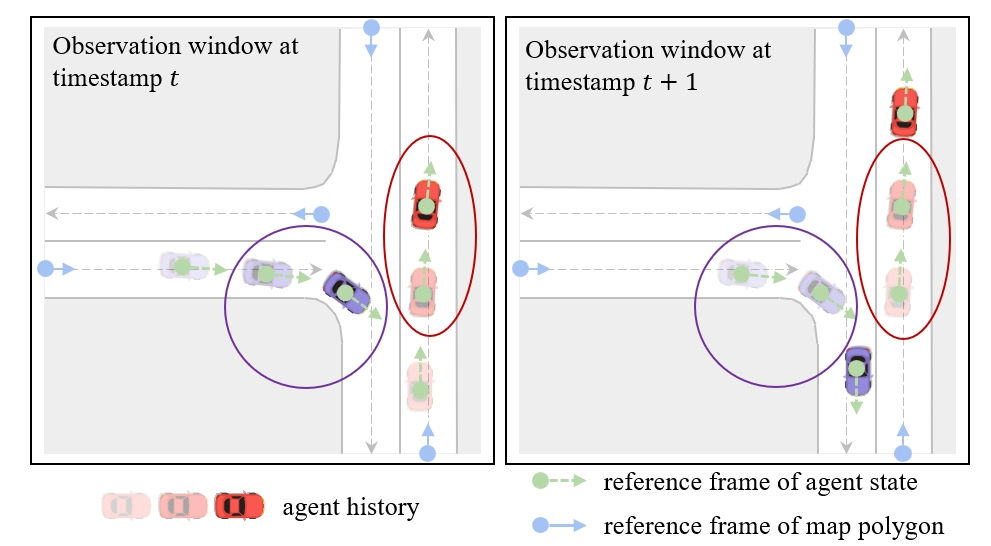
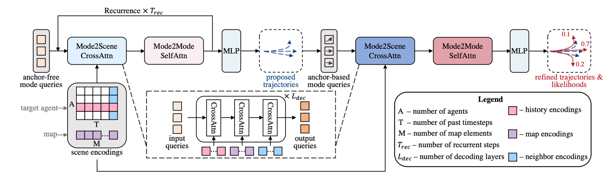

# 联合预测

## 关于 \( P(y_1, y_2, \dots, y_A | X) \) 的假设

### 边际多智能体预测
- **假设：** \( P(y_1, y_2, \dots, y_A | X) = P(y_1 | X) P(y_2 | X) \dots P(y_A | X) \)
- 独立地**预测每个智能体的未来**。

### 联合多智能体预测
- **假设：** \( P(y_1, y_2, \dots, y_A | X) \neq P(y_1 | X) P(y_2 | X) \dots P(y_A | X) \)
- **联合**预测多个智能体的未来。
- 给出多组场景一致的预测轨迹
- 条件预测是基于SDV的轨迹，预测他车的轨迹。

### 为什么要联合预测
#### 场景一致性

- 需要建模**交互**。
- 将不同智能体的边际多模态预测结合在一起，可能会导致场景层面上的轨迹不一致。
- 对于SDV来说，保守策略和激进策略在边缘概率预测难以分辨。

- 如果采用 top 1 轨迹会产生什么问题？
  - 忽视了小概率的场景。
  - 无法保证场景一致性（轨迹会碰撞）。
- 联合预测的难点在何处？
  - 意图的组合会随着智能体数量指数上升。（**维度诅咒**）
- **解决方法：子集预测**
  - \( P(y_{\text{target}_1}, y_{\text{target}_2}, \dots, y_{\text{target}_K} | X) \)
  - 只预测对自动驾驶车辆运动规划重要的智能体！
  - 如何确定重要的智能体？（启发式方法、基于规则、注意力机制分数？）
  

## 预测公式的统一视角

- \( P(y_{\text{target}_1}, y_{\text{target}_2}, \dots, y_{\text{target}_K} | X) \)
  - **K=1**: 单智能体预测 / 边际多智能体预测  
    例子：Argoverse 1、Argoverse 2 单智能体预测，Waymo 运动预测等
  - **K=2**: 双智能体交互预测  
    例子：Waymo 交互预测
  - **K ∈ [1, A]**: 子集联合预测  
    例子：Argoverse 2 多智能体运动预测
  - **K=A**: 全智能体联合预测  
    例子：Waymo 模拟智能体

## 相关工作

- **ILVM**  
  Casas, Sergio, et al. "Implicit latent variable model for scene-consistent motion forecasting." ECCV 2020.

- **Scene Transformer**  
  Ngiam, Jiquan, et al. "Scene transformer: A unified architecture for predicting multiple agent trajectories." ICLR 2022.

- **MotionLM, Trajenglish**  
  Seff, Ari, et al. "Motionlm: Multi-agent motion forecasting as language modeling." ICCV 2023.  
  Phillion, Jonah, Xue Bin Peng, and Sanja Fidler. "Trajenglish: Learning the language of driving scenarios." ICLR 2024.

### ILVM
- 隐式潜变量模型用于场景一致的运动预测

#### 智能体特征提取

- **输入**: Lidar + 高精度地图 (HD Map)
- **目标检测**: 卷积神经网络 (CNN)
- **智能体特征提取**: 旋转兴趣区域对齐 (Rotated Region of Interest Align, RROI)

### Scene-transformer

#### Masked Sequence Modeling（类似BERT）

- **多任务表示：** 模型中的关键表示是一个具有 \( A \) 个智能体的三维张量，具有 \( D \) 个特征维度，并跨 \( T \) 个时间步长。在架构的每一层中，我们旨在保持形状为 \([A, T, D]\) 的表示，或者在解码时跨 \( F \) 个潜在未来表示为 \([F, A, T, D]\)。每个任务（MP、CMP、GCP）可以通过设置特定的掩码策略来构建查询，从而将对应的数据提供给模型。目标是推测场景中时间和智能体子集的遮蔽区域的特征。

#### 场景中心（AV中心）表示

- 为什么在联合预测中使用场景中心表示？
- 弱点？

##### 鲁棒性

- 轨迹预测模型对坐标系统的选择**不**鲁棒。
- scene centric 比 agent centric 预测轨迹质量差。

### 带有分解注意力机制的Transformer

- 每次只在一个维度做注意力。
- **注意力编码器**
  - 输入：智能体特征 \([A, T, D]\)
  - 自注意力（时间维度）× 3
  - 自注意力（智能体维度）
  - 添加额外的智能体/时间维度
  - 交叉注意力（智能体到道路图）
  - 自注意力（时间维度）
  - 自注意力（智能体维度）
  - 交叉注意力（智能体到道路图）
  - 自注意力（时间维度）
  - 自注意力（智能体维度）
  - 输出：智能体特征 \([A + 1, T + 1, D]\)

- **注意力解码器**
  - 输入：智能体特征 \([A + 1, T + 1, D]\)
  - 平铺和多层感知机（MLP）
  - 自注意力（时间维度）× 2
  - 自注意力（智能体维度）
  - 移除额外的智能体/时间维度
  - MLP
  - 输出：智能体特征 \([F, A, T, 7]\)

- **要点**
  - 每一层只对一个维度应用注意力机制。
  - 如果我们将智能体和时间维度展平以获得一维序列，然后直接应用Transformer，会怎么样？ 降低计算开销。O(N2) 复杂度

### winner_take_all: marginal --> joint

**优点：**

- **稀疏性和泛化能力**：专注于学习最相关的特征，从而提高泛化能力。
- **避免平均效应**：优化所有高斯分量可能导致模型在多种可能的未来路径之间进行平均化。
- **梯度优化**：使梯度更新更加稳定和高效。
- **模式选择**：确定哪个高斯分量（或未来路径）最值得关注。

- 从**场景整体**出发选择。
- 边缘预测是从每个agent出发选择最匹配的轨迹，联合预测是根据场景的距离去匹配。

- **数据噪声大用绝对值损失，数据质量高用平方损失。**

### 自回归模型

#### 链式法则

任何多变量分布都可以写成条件概率的乘积形式：

- \( P(AB) = P(A)P(B | A) \)
- \( P(ABC) = P(A)P(B | A)P(C | A, B) \)
- ...

- \( P(x_1, x_2, \dots, x_N) = \prod_{i=1}^{N} P(x_i | x_{1:i-1}) \) - 自回归模型

#### 联合预测的自回归建模：时间维度（类似GPT）

- \( P(Y^1, Y^2, \dots, Y^T | X) = \prod_{t=1}^{T} P(Y^t | Y^{1:t-1}, X) \)，其中 \( Y^t = \{y_1^t, y_2^t, \dots, y_A^t\} \)
- \( P(Y^t | Y^{1:t-1}, X) = \prod_{i=1}^{A} P(y_i^t | Y^{1:t-1}, X) \) - 在单步内独立

- **顺序生成所有智能体的可能未来**
- **建模智能体在每个未来时间步如何相互影响**

#### \( P(y_i^t | y^{1:t-1}, X) \) 可以是什么类型的分布？

##### MotionLM 和 Trajenglish: 离散化 + 分类

- **预处理：离散化**
  - 设计一个运动词汇表
  - 将连续运动转换为索引

- **训练目标**
  - 对分类分布的**负对数似然**（即交叉熵损失）
  - \(-\log \prod_{t=1}^{T} \prod_{i=1}^{A} P(y_i^t | y^{1:t-1}, X) = -\sum_{t=1}^{T} \sum_{i=1}^{A} \log P(y_i^t | y^{1:t-1}, X)\)

##### 离散化的优缺点

**优点：**
- 理论上，类别分布可以逼近任意分布。
- 缓解**分布偏移**：所有生成的标记都在运动词汇表内。

**缺点：**
- 需要手动设计运动词汇表，而不是端到端自动生成。
- 离散化会引入量化误差。

##### 连续分布

需要具有足够的表达能力

- **选项 1：混合模型（例如，高斯/拉普拉斯混合模型）**
  - 理论上可以逼近任意分布，只要使用足够多的模式。

- **选项 2：扩散模型**
  - 当前趋势

##### 自回归模型的弱点

- **慢速的序列采样**
  - 需要逐步运行

- **误差累积**
  - 即使在时间步 \( t-1 \) 的预测中只有很小的误差，这些误差也会在时间步 \( t \) 放大。最终，累积的误差可能会非常大。

##### 结论

- **各种预测任务的公式**
  - 边际、联合、条件

- **相关工作**
  - ILVM：潜变量模型
  - 场景Transformer：赢者通吃回归
  - MotionLM & Trajenglish：自回归模型

## QcNext 

### QCNeXt技术方案三大关键点

- **精度与速度保证**：空间旋转平移不变性 + 时间平移不变性
- **场景一致性**：建模未来时刻的障碍物交互
- **缓解组合爆炸**：障碍物子集联合建模

### 空间不变性的动机

- **补救措施**：将坐标系与目标智能体的姿态对齐。
- 对于多智能体轨迹预测：相对于每个目标智能体对场景进行归一化，并**多次进行单智能体预测。**
  - **低效**
  - **次优**

**我们能否在保证鲁棒性的同时，一次性高效地预测所有智能体的未来？**

### 时间不变性动机：轨迹预测是一项流处理任务

- 最新的观察窗口与其前一个窗口有 T - 1 个时间步的重叠

 **我们能否在观察窗口向前滑动后，复用之前观察窗口中已计算的重叠时间步的编码？**

### agent centric 的输入归一化方法的不足

- **智能体状态**：在以智能体为中心的参考框架中归一化，该参考框架由当前时间步智能体的姿态确定。
  
- **地图元素**：被多次复制，每个副本在一个智能体的参考框架中归一化。

- 每当观察窗口向前滑动时，“当前时间步”也会相应地变化——因此所有输入都需要在最新的参考框架中重新归一化。

# 查询中心场景编码：空间不变性 + 时间不变性

- **视角不变输入嵌入**
  - 为每个代理状态和地图元素构建一个**局部时空坐标系**
  - 在其局部时空坐标系中对代理状态和地图元素进行编码

### query-centric 说明

- **左图：** 时间戳 t 的观测窗口
- **右图：** 时间戳 t + 1 的观测窗口
- 红色椭圆和紫色圆圈表示代理的**重合的轨迹**。
- 蓝色圆圈表示地图多边形的参考框架。

- **query-centric 场景编码**：空间不变性 + 时间不变性
  - **视角不变输入嵌入**
    - 为每个代理状态和地图元素构建一个**局部时空坐标系**
    - 在其局部时空坐标系中对代理状态和地图元素进行编码
  - **相对时空位置嵌入**
    - 相对距离、相对方向、相对朝向、时间间隔

#### 1. 视角不变输入嵌入

- 局部坐标系：每个地图元素 1 个，每个agent T 个
  - agent：\( (p^t_i, \theta_i^t, t) \)
  - hd-map: \( (p_i, \theta_i) \) of entry point of centerline
- 采用独立于坐标系的原始编码（**极坐标**）：
  - motion vector 的模长
  - motion vector 和 heading vector 的夹角
  - velocity vector 的模长
  - velocity vector 和 heading vector 的夹角
  - 这种思想类似于极坐标，将 heading 作为基准，把 motion 和 velocity 转换成 绝对值和角度 表示。（实现了 agent centric 的对齐）
  - motion 是 \( p_i^{t} - p_i^{t - 1} \)
- 转换成傅里叶特征
  - 提取高频率特征
- 通过 MLP 得到输出的 embedding

#### 2. 相对时空位置嵌入

- 描述**两个局部坐标系时空相对关系**的嵌入
- 相对距离、相对方向、相对朝向、时间间隔
  - 相对位置的模长
  - heading 和 相对位置向量的夹角
  - 两个 heading 的夹角
  - 时间index的差距 （静态对象没有这个嵌入）
- 傅里叶特征+MLP 获得嵌入

### 交互建模说明

#### QCNet的两阶段解码管道：轨迹提议 + 轨迹精化

1. **循环的无锚点轨迹提议模块**：
   - 该模块用于生成自适应的轨迹锚点，而不依赖固定的预设锚点。
   - 它使用循环机制来逐步优化轨迹锚点。
   - 提议模块包括：
     - **Mode2Scene 跨注意力**：在模式查询（潜在轨迹）和场景编码（如地图、历史、邻居代理）之间进行交互。
     - **Mode2Mode 自注意力**：允许模式查询内部的相互作用，以进一步调整提议的轨迹。

2. **基于锚点的精化模块**：
   - 在初步提议轨迹之后，使用基于锚点的查询来对轨迹进行精化。
   - 基于锚点的模式查询通过多个解码层进行处理。
   - 最终输出带有每条轨迹可能性的精化轨迹，表示模型对每条轨迹的信心。

**架构流程**：

- 过程从**场景编码**（包括历史、地图等元素）开始，输入到**Mode2Scene跨注意力**模块中。
- 通过**Mode2Mode自注意力**进一步精化这些交互结果，然后通过**MLP**（多层感知器）生成**提议的轨迹**。
- 这些提议的轨迹通过额外的**跨注意力**和**自注意力**机制进一步精化，并计算最终的轨迹可能性。

**不足之处：**
- 与他车的最后一个时刻做注意力交互，相当于生成的提议轨迹只看 0 时刻的他车位置。
  

