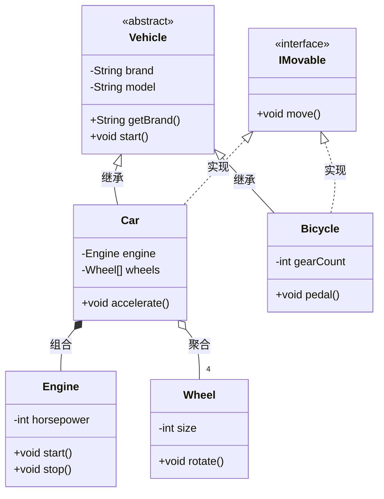

# mermaid

## 示例

```mermaid
classDiagram
    class Vehicle {
        <<abstract>>
        -String brand
        -String model
        +String getBrand()
        +void start()
    }
  
    class IMovable {
        <<interface>>
        +void move()
    }
  
    class Car {
        -Engine engine
        -Wheel[] wheels
        +void accelerate()
    }
  
    class Bicycle {
        -int gearCount
        +void pedal()
    }
  
    Vehicle <|-- Car : 继承
    Vehicle <|-- Bicycle : 继承
    IMovable <|.. Car : 实现
    IMovable <|.. Bicycle : 实现
    Car *-- Engine : 组合
    Car o-- "4" Wheel : 聚合
  
    class Engine {
        -int horsepower
        +void start()
        +void stop()
    }
  
    class Wheel {
        -int size
        +void rotate()
    }
```

## 参考